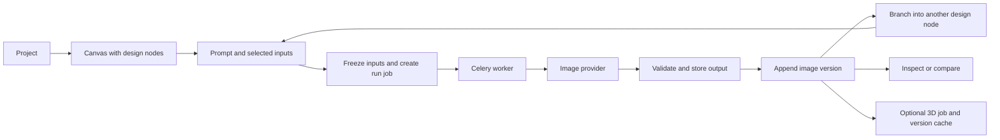
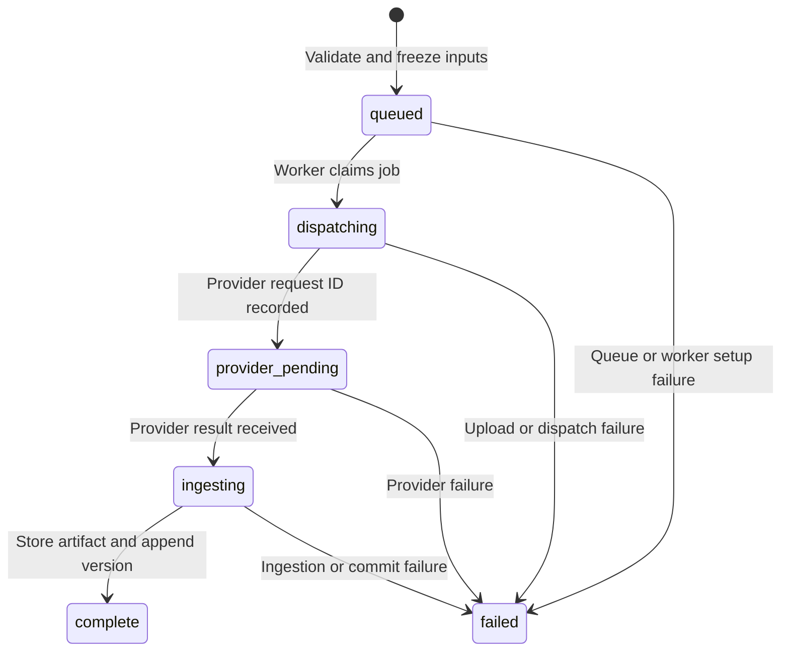

# Clai core features and properties

Code reference prepared on **2026-09-04**, based on the working tree at commit `c0016f0`, including local changes present during inspection.

This document describes the implementation in the frontend components, backend schemas, models, routes, services, providers, storage code, and tests. **UI** means a control exists in the application; **API** means a property or operation is exposed by the backend; **internal** means implementation state or behavior. Provider names, prices, and timing messages below describe values in this code, not independently verified provider offerings or performance.

## Contents

- [Feature overview](#feature-overview)
- [Projects](#projects)
- [Canvas](#canvas)
- [Design nodes](#design-nodes)
- [Prompts and connections](#prompts-and-connections)
- [AI generation and editing](#ai-generation-and-editing)
- [Masks and area selection](#masks-and-area-selection)
- [Versions, branching, and chain collapse](#versions-branching-and-chain-collapse)
- [Image inspection and comparison](#image-inspection-and-comparison)
- [3D generation and viewing](#3d-generation-and-viewing)
- [Saving, synchronization, and run jobs](#saving-synchronization-and-run-jobs)
- [Artifacts, storage, and telemetry](#artifacts-storage-and-telemetry)
- [API reference](#api-reference)
- [Configuration and runtime](#configuration-and-runtime)
- [Current boundaries](#current-boundaries)
- [Existing test coverage](#existing-test-coverage)

## Feature overview

Clai is a canvas for exploring physical-product concepts through AI-generated images. It has **one registered canvas node type: `design`**. A node's inputs determine whether a run generates a new image, edits a subject, uses references, or performs an area edit. A 3D model is an associated view of an image version; it is not another canvas node type.

| Core area | Implemented capabilities |
| --- | --- |
| Projects | Create, list, open, rename, delete from the active list, retain history, display the latest generated thumbnail. |
| Canvas | Move nodes, pan, zoom, select multiple elements, fit the graph, create connections, delete elements, use keyboard shortcuts. |
| Design nodes | Edit title and prompt, toggle generation background, run/retry, inspect images, select versions, branch, duplicate drafts, apply masks, open 3D. |
| AI images | Text generation, generation with references, instruction edits, reference-guided edits, partial-mask inpainting. |
| Connections | One pinned subject image and up to two references that follow their source node's active image. |
| Masks | Brush, lasso, rectangle, erase, local undo, SAM click/text selection, subject binding, deterministic output compositing. |
| History | Immutable versions, active selection, hide/restore, branch navigation, explicit chain-collapse preview and run. |
| Image viewer | Original-image inspection, pan/zoom, original download, two-pane comparison. |
| 3D | Tripo image-to-3D, standard textures, per-version cache, rotate/zoom viewer, preview image, upgrade older shape-only models. |
| Persistence | Scoped saves, revision conflicts, periodic refresh, durable job status, frozen generation inputs, retained artifacts. |

The main flow is:

Sources: [workspace](frontend/components/graph/graph-workspace.tsx), [run submission](backend/app/services/run_jobs.py), [run execution](backend/app/services/run_execution.py), [mesh API](backend/app/api/meshes.py).

## Projects

The home page displays projects ordered by `updated_at` descending, with ID as a tie-breaker. Each tile contains a name, thumbnail or placeholder, relative update time, and rename/delete controls. An empty collection displays a first-project action.

| Property | Type / default | Behavior |
| --- | --- | --- |
| `id` | UUID, generated | Project identity and route parameter. |
| `name` | String, 1–120 characters | Required by the API; whitespace is trimmed and blank names are rejected. The UI creates `Untitled Project`. |
| `created_at` | Timestamp | Database creation time. |
| `updated_at` | Timestamp | Changes with project activity, including graph changes and completed image generation. |
| `thumbnail_url` | URL or `null` | Set to the artifact from the most recently completed image run in the project. |
| `deleted_at` | Timestamp or `null`, internal | Hides a deleted project while retaining its records. Not returned by `ProjectRead`. |

Renaming is inline, with Save/Cancel and Escape support. Deletion asks for confirmation, removes the project from the active list, and makes normal project/graph reads return 404. There is no restore-project endpoint or trash view. Creating a project opens an initially empty canvas at `/projects/{id}`.

Sources: [project model](backend/app/models/project.py), [project schemas](backend/app/schemas/project.py), [project API](backend/app/api/projects.py), [project tiles](frontend/components/projects/project-tile.tsx), [project grid](frontend/components/projects/project-grid.tsx), [creation control](frontend/components/projects/new-project-button.tsx).

## Canvas

### Navigation, layout, and selection

| Feature / property | Actual behavior |
| --- | --- |
| Graph renderer | React Flow with the `design` node registration. |
| Background | Dotted grid, gap `20`, dot size `1`. This is a visual background; no grid snapping is configured. |
| Node positioning | Stored as finite numeric `position.x` and `position.y`; node positions save when dragging settles. |
| Zoom range | `0.1`–`2` (10%–200%). |
| Initial fit | Fits the graph with padding `0.2`, capped at zoom `1`. |
| Pan | Space-drag or middle/right mouse drag. |
| Selection | Drag selection and Shift multi-selection. |
| Controls | Zoom and fit controls; the React Flow interaction-toggle control is hidden. |
| Visibility optimization | `onlyRenderVisibleElements` is enabled. |
| New-node placement | Starts near the viewport center and searches nearby positions to reduce overlap. |
| Branch placement | Starts about `380` canvas units to the right of the source and searches for room. |
| Duplicate placement | Starts about `500` units to the right and searches for room. |
| Focus/jump | Selects a node and centers on it at zoom `1`, with a `350 ms` transition. |
| Viewport persistence | Pan/zoom and selection are local UI state; the graph schema persists node positions, not a viewport. |
| Empty canvas | Shows instructions and an “Add your first node” action. |

Placement uses a bounded search with `380` horizontal and `850` vertical spacing. It is a placement heuristic, not an automatic graph-layout engine or a guarantee against overlap.

### Keyboard shortcuts

| Shortcut | Context | Action |
| --- | --- | --- |
| `N` | Canvas | Add a design node. |
| `B` | Canvas, selected node has an active image | Branch from that active version. |
| `Cmd/Ctrl + D` | Canvas, node selected | Duplicate the selected draft. If several nodes are selected, the custom handler uses the first selected node. |
| `F` | Canvas | Fit graph. |
| `Shift` | Canvas | Multi-selection modifier. |
| `Space` + drag | Canvas | Pan. |
| `Backspace` / `Delete` | Canvas | Delete selected nodes/edges. |
| `Cmd/Ctrl + Enter` | Prompt editor | Submit the node's run. Backend validation still applies. |
| `@` | Prompt editor | Open the connect-source picker. |
| `Enter` | Prompt editor | Insert a newline. |
| `Escape` | Viewer/dialog | Close the applicable dialog; the mask editor blocks closing while busy. |

Custom canvas shortcuts are ignored while typing in inputs, textareas, selects, or editable content, and while a modal dialog is open. Canvas deletion keys are disabled while a mask, image, collapse, or mesh dialog is active.

Deleting nodes with outgoing connections or unsaved changes prompts for confirmation. A node with dependents or run history is marked deleted; an unused node without either can be physically removed. Retained subject images remain usable by existing subject pins. References to deleted sources become broken chips and prevent runs.

Sources: [workspace and shortcuts](frontend/components/graph/graph-workspace.tsx), [node frame](frontend/components/graph/node-frame.tsx), [node deletion API](backend/app/api/graph.py).

## Design nodes

### Visible controls

Each node contains an editable title, prompt editor, Run/Retry control, and duplicate/delete actions. A draft has no main image because it has not produced a result yet. When applicable, a node also shows:

- A pinned subject thumbnail, source title, and Inspect action.
- “Select an area to edit” / “Edit mask”.
- Active-image branching, edit-hop count, and 2D/3D view buttons.
- Version thumbnails, hide/restore controls, branch links, and comparison selection.
- Run stage, elapsed time, errors, and draft-conflict actions.
- Chain-collapse actions at edit depth `2+`, with a stronger identity-loss message at depth `5+`.
- Pixel-preservation measurement for completed masked edits.

The frame is `19rem` wide. A completed result uses a `4:3` preview with `object-contain`; the original artifact is available in the image viewer. An input remains available through its subject thumbnail and Inspect action but is never presented as the draft's result. The white-background checkbox appears on every editable draft.

### Node properties

| Property | Type / default | Access and meaning |
| --- | --- | --- |
| `id` | UUID | API identity; creation can supply it, otherwise the API generates it. |
| `title` | String; `Untitled concept` | UI/API editable, trimmed, 1–120 characters on create/update. |
| `prompt` | String; empty | API display/plain-text representation. Connect chips appear as `@` in this representation. |
| `document` | Ordered prompt-part array | Canonical text and connect-chip structure; edited through the prompt endpoint. |
| `settings` | `NodeSettingsData` | Image-generation settings described below. |
| `seed` | Integer or `null`; `null` | API override; no seed field in the current node UI. |
| `active_version_id` | UUID or `null` | Selected image; must belong to this node. Can be cleared through the API. |
| `position` | `{x: number, y: number}` | Required on creation; non-finite coordinates are rejected. |
| `versions` | Version array | Read-only output history, ordered by creation time and ID. |
| `mask` | Mask object or `null` | Subject-bound selection, managed through the mask endpoint. |
| `revision` | Integer; `0` initially | Revision used for node and prompt save conflicts. |
| `deleted` | Boolean | Derived from internal `deleted_at`; deleted records can remain in graph responses for retained references. |
| `run` | Run-job object or `null` | Latest job attached by the full graph response. |

Database-only node properties also include `project_id`, `created_at`, `updated_at`, `deleted_at`, `position_x`, and `position_y`. Masks are stored in `mask_rle`, `mask_width`, `mask_height`, and `mask_subject_version_id` columns. The database `prompt` column stores the structured document, despite the public `prompt` field being a string.

The full graph response enriches nodes with current run state and version visibility/branch/metric data. Individual node mutation responses use a simpler serializer, so clients should refresh the graph when they need those derived values.

The frontend also derives these display properties; they are not additional editable API fields:

| Browser property | Shape / purpose |
| --- | --- |
| `activeVersionId` | Camel-case representation of `active_version_id`. |
| `subject` | `null` or `{nodeId, deleted, nodeTitle, versionId, artifactUrl}` for the resolved pinned-image preview. |
| `connects` | Ordered previews `{edgeId, nodeId, title, state}`; `state` is `ready`, `empty`, or `deleted`. |
| `remoteDeleted` | Marks a locally retained draft whose server node was deleted. |
| `draftError` | Save/conflict message or `null`. |
| `meshPreview` | `null` or `{versionId, url}` for the session's static 3D card preview. |
| Display `run` | `{status: "idle"}`, `{status: "running", job, startedAt}`, or `{status: "failed", message}`. This wraps the API job. |
| React Flow state | `selected`, `measured`, and `dragging` support interaction and placement; they are not persisted graph properties. |

### Image settings

| Setting | Default | Validation / effect | UI exposure |
| --- | --- | --- | --- |
| `aspect_ratio` | `1:1` | API accepts a nonempty string up to 16 characters; Nano Banana performs its own supported-value check. | API only. |
| `width` | `1024` | Integer, `1`–`4096`; helps select Nano Banana's resolution tier. | API only. |
| `height` | `1024` | Integer, `1`–`4096`; helps select Nano Banana's resolution tier. | API only. |
| `whiteBackground` | `true` for new nodes | Adds a white-background instruction to generation and edit operations. | Checkbox on every editable draft. |

Older stored settings without `whiteBackground` are read as `true`. The internal Python domain uses `white_background`; persisted settings and API JSON use `whiteBackground`. A settings PATCH replaces the settings object using schema defaults for omitted members; it is not a deep merge.

If a run completes while the title is exactly `Untitled concept`, the backend names the node from the first eight words of the frozen user prompt, capped at 120 characters. Node titles do not supply extra AI prompt context.

### Run availability

The visible Run button requires a nonblank prompt, a node that has not been remotely deleted, no current run, no stale mask, no broken reference, and no partial-mask/reference combination. The backend validates resolved inputs independently, including submissions through the keyboard shortcut or direct API.

Sources: [design node](frontend/components/graph/design-node.tsx), [graph schemas](backend/app/schemas/graph.py), [graph models](backend/app/models/graph.py), [graph serialization and updates](backend/app/services/graph_service.py), [version commit](backend/app/services/run_execution.py).

## Prompts and connections

### Structured prompts

Prompts are ordered documents made of two part types:

| Part | Properties | Meaning |
| --- | --- | --- |
| Text | `type: "text"`, `text: string` | Literal prompt text. |
| Connect | `type: "connect"`, `edge_id: UUID`, `source_node_id: UUID` | Atomic reference to another node's active image. |

The document accepts up to `128` parts. Each text part has an `8000`-character limit, and the service enforces a combined text limit of `8000` characters. There can be at most two connect parts, with unique source nodes and unique edge IDs.

Typing `@` opens a picker filtered by node title. Enter inserts the first eligible result; Escape/Cancel closes it. Existing references and the current node are excluded from available sources. Chips display source titles, highlight source nodes on hover, and jump to them on click. Backspace/Delete can remove a neighboring chip atomically. Pasting inserts plain text; literal `@` text is not automatically a connection.

Saving a prompt updates its chips and corresponding connect edges in one transaction. Removing a chip removes its edge; deleting a connect edge removes the corresponding chip. Plain-string prompt updates are rejected if they would overwrite a document containing chips.

### Subject versus connect

| Property | Subject | Connect/reference |
| --- | --- | --- |
| `role` | `subject` | `connect` |
| Maximum incoming count | One per target. | Two per target. |
| Pin | `{mode: "version", version_id}` | `{mode: "active"}` |
| Source image | Exact immutable version selected when connected. | Source node's active version at run submission. |
| Order | `null` | Contiguous integers from `0`, following chip order. |
| Purpose | Object/image being edited. | Additional visual input referenced in the instruction. |
| UI wire | Solid blue. | Dashed purple. |
| Target handle | Left side at about 35% of node height. | Left side at about 70% of node height. |
| Create | Drag from a node with an active image, or branch from a version. | Insert a chip or drag to the connect handle. |
| Replacement | A second subject replaces the existing pin atomically. | Duplicate source references are rejected. |
| Deleted source | Existing pinned image is retained and can still resolve. | Source is broken and blocks new runs. |

Both edge types contain `id`, `source_node_id`, and `target_node_id`. Database rows additionally store `project_id`, `pin_mode`, `pinned_version_id`, `connect_order`, and `created_at`. Edges are scoped to their project, cannot connect a node to itself, and subject pins must belong to their stated source node. The same source may serve as both the subject and one connect reference.

A connect may be saved before its source has an image; it remains visibly empty and blocks generation until that source has an active version. Deleting or replacing the subject does not silently remap an existing mask.

### Runtime image numbering and context

At submission, chips become `image 1`, `image 2`, etc. If a subject exists, it occupies image 1 and connect numbering starts at image 2. Upload order matches these positions.

For example, with a subject and one chip, `Use the finish from @Material study` compiles to `Use the finish from image 2`; image 1 is the pinned subject. The chip's title and its source node's prompt are not appended to the generation request.

Ordinary runs use the current target prompt and resolved images. They do not replay ancestor prompts. Changing a source's active image affects a future connect-based run, while an already submitted run keeps its frozen image selection.

Sources: [prompt editor](frontend/components/graph/prompt-editor.tsx), [prompt compilation](backend/app/domain/prompts.py), [atomic prompt/edge saves](backend/app/services/graph_service.py), [input resolution](backend/app/services/run_resolution.py), [run freezing](backend/app/services/run_jobs.py), [edge styling](frontend/lib/graph.ts).

## AI generation and editing

### Operation routing

Users choose inputs; the backend selects the operation. There is no model or operation dropdown in the node UI.

| Subject | Effective partial mask | Connects | Operation | Execution |
| --- | --- | --- | --- | --- |
| No | No | 0 | `generate` | Nano Banana Pro text-to-image endpoint. |
| No | No | 1–2 | `generate_ref` | Nano Banana Pro edit endpoint using reference images. |
| Yes | No | 0 | `edit_instruct` | Nano Banana Pro edit endpoint with subject and instruction. |
| Yes | Yes | 0 | `edit_inpaint` | FLUX Fill plus deterministic compositing. |
| Yes | No | 1–2 | `edit_ref_guided` | Nano Banana Pro edit endpoint with subject followed by references. |
| Yes | Yes | 1–2 | `edit_composite` | Defined in the domain/schema, but blocked by run submission because the configured fill provider cannot accept references. |

A mask without a subject is invalid. An all-image mask is normalized to no effective mask after checking its subject binding; it routes to an ordinary instruction or reference-guided edit. A stale all-image mask still blocks the run.

### Nano Banana Pro contract

| Property | Implemented value / behavior |
| --- | --- |
| Provider ID | `fal` |
| Model ID | `gemini-3-pro-image` |
| Generate endpoint | `fal-ai/nano-banana-pro` |
| Edit/reference endpoint | `fal-ai/nano-banana-pro/edit` |
| `prompt` | Final compiled runtime prompt. |
| `num_images` | `1` |
| `seed` | Resolved seed, described below. |
| `aspect_ratio` | `auto`, `21:9`, `16:9`, `3:2`, `4:3`, `5:4`, `1:1`, `4:5`, `3:4`, `2:3`, or `9:16`. |
| `resolution` | `1K` if the larger requested dimension is at most 1024; `2K` through 2048; otherwise `4K` through 4096. |
| `output_format` | `png` |
| `limit_generations` | `true` |
| `enable_web_search` | `false` |
| `image_urls` | Included for edit/reference calls; uploaded subject first, then ordered connects; maximum three inputs. |

Width and height select a resolution tier rather than being sent as exact output dimensions. Supported aspect ratios are checked during provider preparation, beyond the more permissive API string validation. The adapter rejects masks rather than silently ignoring them.

Input images are read from Clai's artifact storage and uploaded to fal. The adapter records the provider request and uses the first returned image.

### Prompt behavior

When White bg is on, generation and edit prompts include: `Place the object on a clean white background.` This changes the prompt; it is not a deterministic background-removal or pixel-fill operation.

Edits prepend instructions to keep the same object, camera angle, framing, and unmentioned attributes while fully applying named changes such as form, proportions, color, material, or finish. They request a clean white background when White bg is on and preservation of the input background when it is off.

Unmasked preservation depends on model output. Exact preservation outside a mask is supplied separately by the compositing code.

### Seeds and edit depth

| Property | Rule |
| --- | --- |
| Seed priority 1 | Explicit target-node `seed`, when set. |
| Seed priority 2 | Pinned subject version's seed. |
| Seed priority 3 | A new random 32-bit seed. Connect seeds are not inherited. |
| Generation depth | `0` for `generate` and `generate_ref`. |
| Edit depth | Subject version's `edit_depth + 1`. |
| Repeated node runs | Reuse the node's wiring. The node's own active output does not automatically become its next subject. Branch from a result to build another edit hop. |

Sources: [operation router](backend/app/services/operation_routing.py), [submission guard](backend/app/services/run_jobs.py), [Nano Banana adapter](backend/app/providers/nano_banana.py), [provider dispatch](backend/app/providers/factory.py), [prompt builder](backend/app/services/prompt_builder.py), [seed resolution](backend/app/services/run_resolution.py), [depth and freezing](backend/app/services/run_freezing.py).

## Masks and area selection

### Manual editor

The editor opens against a node's pinned subject, at the original image's natural pixel dimensions. Orange indicates selected pixels; the overlay is displayed at 50% opacity.

| Control / property | Behavior |
| --- | --- |
| Brush | Round brush with diameter `3`–`160` image pixels; default `30`. |
| Lasso | Draw and close a freehand polygon; fills it on release. |
| Rectangle | Drag to fill a rectangular region. |
| Erase | Removes manual selection; in SAM click mode, sends a negative point label. |
| Undo | Up to 12 local selection snapshots; no redo control. |
| Clear selection | Clears the editable overlay and adds an undo snapshot. |
| Save mask | Persists a nonempty selection bound to the current subject version. |
| Remove mask | Persists `null`, clearing the stored selection. |
| Close | Discards unsaved editor changes; disabled during selection/save work. |
| Full selection | Warns that the next run will be an ordinary unmasked edit. |
| Changed subject/dimensions | Warns about the old mask and asks for a new selection. |

### Mask properties

| Property | Type / limit | Meaning |
| --- | --- | --- |
| `rle` | Nonempty string, at most 16,000,000 characters | One-based, row-major start/length pairs, separated by spaces. |
| `width` | Integer, `1`–`4096` | Must match the subject artifact width. |
| `height` | Integer, `1`–`4096` | Must match the subject artifact height. |
| `subject_version_id` | UUID | Exact image version to which the coordinates belong. |

Runs must be positive-length, ordered, nonoverlapping, and in bounds. Empty selections are rejected. Browser encoding treats overlay alpha of at least `128` as selected. For an entire image, canonical RLE is `1 {width * height}`.

Changing or disconnecting a subject leaves the stored binding available for validation; the run then fails until the selection is removed or replaced. Mask saving checks both the current subject pin and the stored artifact's dimensions.

### SAM selection

| Property / feature | Implementation |
| --- | --- |
| Provider endpoint | `fal-ai/sam-3/image-rle` |
| Selection modes | A click point, a text description, or both. |
| Request `text` | Default empty, maximum `240` characters; trimmed for submission. |
| Request `points` | Up to `32` points, each `{x, y, label}`; nonnegative integer coordinates inside the image. |
| `label` | `1` for positive selection, `0` for negative selection. |
| Browser click behavior | Sends one point per click with the current text; it does not accumulate a multi-point click history. |
| Provider payload | Uploaded `image_url`, `prompt`, `point_prompts`, `return_multiple_masks: true`, `max_masks: 3`, `apply_mask: false`. |
| Result handling | Unions returned regions into one mask; returns `null` if nothing is selected. |
| Editor integration | Replaces the current overlay with the result and retains the previous selection in local undo history. Requires Save mask to persist. |
| UI cost label | `Select · ~$0.005`, a hard-coded display string. |
| Errors | No-match and provider-error messages; an unsuccessful selection preserves the existing overlay. |

SAM selection is a synchronous API operation, separate from the durable image/mesh job queues. The API requires either nonblank text or at least one point.

### Inpainting and preservation

FLUX Fill uses provider `fal`, model `flux-1-fill-pro`, endpoint `fal-ai/flux-pro/v1/fill`. Its request includes `prompt`, uploaded `image_url`, uploaded black/white `mask_url`, `seed`, `num_images: 1`, `output_format: "png"`, and `enhance_prompt: false`. It requires a valid partial mask and accepts no connect images. Node aspect ratio and width/height settings are not sent to this adapter.

After generation, the backend:

1. Reads the original subject and generated image as RGBA.
2. Resizes generated output to the subject's size with Lanczos if needed.
3. Uses generated pixels fully inside the mask.
4. Blends into the original through a fixed `3 px` outer band.
5. Uses original pixels outside that band and stores the composite as PNG.
6. Measures normalized mean pixel difference outside the band as `masked_outside_change`.

This supplies exact preservation of decoded pixels outside the blend band. It does not measure whether the requested edit was successful or guarantee preservation within the selected area/seam.

Sources: [mask editor](frontend/components/graph/mask-editor.tsx), [browser RLE](frontend/lib/mask-rle.ts), [mask API](backend/app/api/masks.py), [SAM adapter](backend/app/providers/sam.py), [FLUX Fill adapter](backend/app/providers/flux_fill.py), [mask validation and compositing](backend/app/services/masks.py), [artifact ingestion](backend/app/storage/artifacts.py).

## Versions, branching, and chain collapse

### Version properties

Successful image runs append an immutable version and make it active on the target node. PostgreSQL migrations install a trigger rejecting UPDATE and DELETE on the `versions` table. Visibility, telemetry, and meshes use separate records.

| Property | Meaning |
| --- | --- |
| `id` | UUID for this immutable image result. |
| `node_id` | Owning node. |
| `created_at` | Creation timestamp. |
| `artifact_url` | Stored image URL. |
| `op` | One of the six operation enum values. |
| `provider` | Actual provider identifier. |
| `model` | Actual model identifier. |
| `endpoint` | Provider endpoint used. |
| `params` | Actual provider request payload plus the frozen `whiteBackground` value. |
| `seed` | Seed resolved for this run. |
| `input_snapshot.subject_version_id` | Pinned subject used, or `null`. |
| `input_snapshot.connect_version_ids` | Ordered, resolved reference version IDs. |
| `input_snapshot.mask_hash` | SHA-256 of effective mask dimensions, subject ID, and RLE, or `null`. |
| `prompt_at_runtime` | Exact compiled prompt sent to the provider. |
| `edit_depth` | Generation depth `0`, or subject depth plus one. |
| `hidden` | Derived visibility flag; defaults to `false`. |
| `branch_node_ids` | Derived list of live nodes whose subject currently pins this version. Includes manually created subject connections. |
| `masked_outside_change` | Completed outside-feather pixel metric for masked edits, otherwise `null`. |

Additional database properties are `run_job_id`, `artifact_storage_key`, `artifact_sha256`, `artifact_content_type`, and `provider_response_metadata`. A unique constraint permits only one version per run job. The full frozen mask and input snapshots are retained with the job; the version's public input snapshot carries the mask hash.

### Version navigation and visibility

- The horizontal strip labels history `v1`, `v2`, etc., highlights the active version, and scrolls it into view.
- Clicking a version changes the active pointer; it does not restore an old prompt, settings, or wiring.
- Each version offers Branch and Hide/Restore controls.
- “Show retained” reveals hidden entries; hidden versions remain stored and can still be compared or branched.
- Hiding the active version selects the newest remaining visible version, or clears the active pointer if none remain.
- Selecting a hidden version automatically restores its visibility. Merely restoring visibility does not automatically select it.
- Branch counts expand into source-linked navigation actions for live dependent nodes.

### Branch versus duplicate

| Behavior | Branch from version | Duplicate draft |
| --- | --- | --- |
| Starting context | A specific image version. | A node's current draft and incoming wiring. |
| New title | Default `Untitled concept`, unless supplied; collapse supplies a special title. | Source title with ` · copy`, truncated to fit. |
| Prompt | Empty by default, or API-supplied prompt. | Copies the structured prompt, regenerating connect edge IDs. |
| Settings | New-node defaults unless supplied through the branch API. | Copies source settings. |
| Seed | `null` initially; run resolution can inherit the subject seed. | Copies source seed override. |
| Subject | Pins the chosen version. | Copies the source draft's subject pin. |
| Connects and mask | Not copied by ordinary branching. | Copied with the draft. |
| Existing versions / active output | Empty history, no active version. | Empty history, no active version. |
| Immediate generation | Ordinary branching creates a draft without running it. | Creates a draft without running it. |

The branch API can use a retained image even if its original node has been deleted. The visible version strip only exists on live canvas nodes.

### Chain collapse

Chain collapse creates a new edit against an earlier root image to reduce accumulated edit depth. The preview endpoint follows recorded `subject_version_id` history and assembles instructions in chronological order, stating that later changes take precedence. It does not call another AI model to summarize the chain.

Collapse requires at least two historical `edit_instruct` operations. It refuses chains containing masked or reference-guided edits, cycles, missing recorded subject information, unavailable legacy instructions, or combined instructions longer than 8000 characters. For old jobs without `user_prompt`, it only accepts a specifically recognized legacy prompt envelope.

The dialog presents the combined instruction for editing. “Run collapse against root” creates a new branch titled with ` · collapsed`, submits one image run, and opens a before/after comparison when successful. The original chain stays intact. This is a new provider generation, not a metadata-only history rewrite.

Sources: [version model](backend/app/models/graph.py), [immutability migration](backend/alembic/versions/b7a4f0c9d2e1_p0_durable_graph.py), [version strip](frontend/components/graph/version-strip.tsx), [branch service](backend/app/services/graph_service.py), [duplicate API](backend/app/api/graph.py), [visibility and collapse API](backend/app/api/versions.py), [collapse dialog](frontend/components/graph/collapse-dialog.tsx).

## Image inspection and comparison

| Feature | Behavior |
| --- | --- |
| Open | Click an active 2D image or Inspect on a subject; choose another version in the comparison selector for two panes. |
| Source | Loads the original stored artifact, not the card's cropped presentation. |
| Dialog | Approximately 96% viewport width and 94% viewport height. |
| Zoom | Wheel zoom and plus/minus controls; per-pane scale clamped to `0.25`–`8`. Buttons multiply/divide scale by `1.25`; wheel steps use `1.1`. |
| Pan | Pointer drag within each image pane. |
| Fit | Resets scale to `1` and pan offsets to `0` relative to the pane's fitted image. |
| Comparison | Two independent panes with timestamps; no synchronized pan/zoom or difference overlay. |
| Download | Fetches original bytes and saves `clai-{version.id}.jpg`, `.webp`, or `.png` according to MIME type. |
| Close | Close button or Escape. |

The version-strip comparison is between the active image and another version of that node, including retained versions. Collapse additionally compares the old chain result with the new branch result. Generic pane labels are positional (“Before / reference” and “After / comparison”), not a guarantee of chronological order.

Sources: [image viewer](frontend/components/graph/image-viewer.tsx), [comparison selection](frontend/components/graph/version-strip.tsx), [collapse comparison](frontend/components/graph/graph-workspace.tsx).

## 3D generation and viewing

### Workflow and controls

“3D form” opens a modal tied to the selected image version. Opening it first reads that version's mesh cache. It does not automatically submit a generation. The Generate action creates the job; the current UI always requests standard textures.

| Feature / property | Behavior |
| --- | --- |
| Source | Exact immutable 2D artifact selected when the mesh job is created. |
| Backend | Tripo through fal. |
| Endpoint / stored model ID | `tripo3d/tripo/v2.5/image-to-3d` |
| `image_url` | Original Clai image bytes uploaded to fal. |
| `texture` | `standard` by default; API also accepts `no`. |
| `pbr` | `true` with standard textures, `false` for shape-only requests. |
| `texture_alignment` | `original_image` |
| `orientation` | `align_image` |
| Generated artifact | Self-contained GLB version 2. |
| Preview | Optional provider-rendered PNG/JPEG/WebP, copied into Clai storage. |
| UI price label | `Generate 3D · $0.30`; the same displayed amount is used for retry/texture upgrade. |
| Progress | Queued, generating, and saving labels; client polls every `2 seconds`. |
| Elapsed time | In-progress counter measures time in the open view. Saved `elapsed_seconds` measures worker execution through ingestion, excluding queue wait. |
| Closing the dialog | Removes the viewer; an already queued job continues. |
| Completion | Reopens the cached model; no new generation is submitted for a completed standard-texture cache. |

The viewer displays a reminder that rear/hidden surfaces are inferred and reconstructed colors or printed details can vary. It also shows the original 2D image as a small reference overlay.

### Mesh properties

| Property | Type / meaning |
| --- | --- |
| `version_id` | UUID; primary key of the per-version cache. |
| `attempt_id` | UUID required on creation; identifies this generation/upgrade attempt. |
| `status` | `queued`, `dispatching`, `provider_pending`, `ingesting`, `complete`, or `failed`. |
| `texture` | `no` or `standard`; default `standard`. |
| `artifact_url` | Stored GLB URL when complete, otherwise normally `null`. |
| `preview_url` | Optional stored preview URL. |
| `error` | Failure message or `null`. |
| `elapsed_seconds` | Recorded execution duration or `null`. |

Internal mesh properties additionally include `provider`, `model`, `source_artifact_url`, `request_payload`, `provider_request_id`, `started_at`, `provider_response_metadata`, `created_at`, and `updated_at`. Stored response metadata includes `task_id`, `artifact_sha256`, `artifact_storage_key`, and `byte_size`.

### Caching, retries, and validation

There is one mesh-cache row per image version. Repeating an attempt ID returns the same row; an existing active job or completed standard-texture model is reused. A failed job can be retried with a new attempt ID. A completed `texture: "no"` model can be upgraded to `standard` with a new attempt. The UI exposes this as “Regenerate with colors & print”.

An upgrade regenerates from the frozen 2D source image, not from the old grey mesh. The row is reset for the new attempt; there is no mesh-attempt history browser. Switching the node to another image version uses that version's own cache.

For textured output, ingestion prefers `pbr_model`, falling back to `model_mesh`; shape-only ingestion prefers `model_mesh`, then `base_model`. The GLB validator checks the header/version/length and JSON chunk type, rejects external buffer/image URIs, and requires a base-color texture actually referenced by a mesh primitive when textures were requested. A URL pointing at an untextured model cannot satisfy a textured job merely because its response field is named `pbr_model`.

Provider outputs are downloaded and validated before the cache becomes complete. A failed mesh job does not invalidate the 2D version.

### Browser viewer

The viewer dynamically imports `@google/model-viewer`, enables camera controls for rotation/zoom, uses shadow intensity `0.4`, and uses the saved preview as a loading poster when available. The model cache size is set to `1`, and the active element is removed on dialog close.

A completed mesh with a preview can replace the node's card image with that static preview for the current session. “2D image” returns the card to the original image. This preview choice is local state and is matched to the active version. Interactive 3D rendering occurs in the modal rather than across every node on the canvas.

Sources: [mesh viewer](frontend/components/graph/mesh-viewer.tsx), [mesh client types](frontend/lib/meshes.ts), [mesh API and deduplication](backend/app/api/meshes.py), [Tripo adapter](backend/app/providers/tripo.py), [mesh worker service](backend/app/services/mesh_jobs.py), [GLB ingestion](backend/app/storage/meshes.py).

## Saving, synchronization, and run jobs

### Draft saves and conflicts

| Feature | Behavior |
| --- | --- |
| Autosave delay | Title, background-setting, and prompt edits use a `500 ms` debounce. |
| Drag saves | Node positions are persisted after dragging settles. |
| Save ordering | Pending saves are serialized per node. |
| Before generation | Pending node and document changes are saved before submitting the run. |
| Status indicator | `Saved`, `Saving…`, or `Save failed`. |
| Cross-tab refresh | Full graph refresh every `3 seconds` while the document is visible. |
| Conflict detection | Node PATCH accepts optional `expected_revision`; prompt PUT requires it. Stale revisions return 409. The frontend sends revisions for its saves. |
| Local draft preservation | Refresh preserves pending local documents, title/settings changes, and in-progress positions. |
| Keep my draft | Reads the newest revision, then reapplies the pending local changes. |
| Use saved draft | Confirms discarding local changes, clears them, and reloads the saved node. |
| Remote deletion | A node with pending local changes remains visible as a non-runnable local draft with a copy-before-removal message. |
| Interrupted connection | Shows a connection message and retries graph/status reads. |
| Navigation protection | Browser unload warning and Projects-link confirmation when local changes are pending. |

Draft buffers live in browser memory; no localStorage/IndexedDB recovery is implemented. Periodic graph refresh is polling, not a shared editing session with live cursors. Revision checks cover node/document saves; subject and mask endpoints have their own validation and do not implement the same `expected_revision` contract.

### Image-run lifecycle

| Public job property | Type / meaning |
| --- | --- |
| `id` | UUID for the run. |
| `node_id` | Target node. |
| `status` | One of the six lifecycle states above. |
| `op` | Operation derived from the frozen request. |
| `attempts` | Nonnegative integer; increments when the worker claims a queued job. |
| `error` | Failure details or `null`. |
| `version_id` | Result version ID after completion, otherwise `null`. |
| `created_at` | Job creation time. |
| `completed_at` | Terminal-state timestamp or `null`. |

Internal job properties include `project_id`, `idempotency_key`, `frozen_request`, `provider`, `model`, `endpoint`, `provider_request_id`, `provider_request_payload`, `provider_response_metadata`, `queued_at`, `started_at`, and `updated_at`.

The frozen request contains `node_id`, compiled `user_prompt`, `op`, `prompt_at_runtime`, resolved `seed`, `settings`, `subject`, ordered `connects`, effective `mask`, `input_snapshot`, and `edit_depth`. Each frozen image snapshot contains `id`, `node_id`, `artifact_url`, `seed`, and `edit_depth`. Workers consume this snapshot instead of rereading live wiring or draft text.

### Persistence and duplicate protection

- Submission records and commits a database job before enqueueing its UUID to Celery.
- The API requires an `idempotency_key` of 1–120 characters and reuses matching node/key submissions.
- A second submission for a node with an in-flight run also reuses that run, even with a different key.
- Claiming is restricted to queued jobs; non-queued jobs are not blindly resubmitted to the paid provider.
- Provider submission uses a single explicit HTTP POST. No automatic paid-submission retry loop is implemented.
- A successful transaction appends the version, advances the active pointer, updates the project thumbnail, and marks the job complete. The version's unique `run_job_id` prevents duplicate version insertion.
- Completing a run preserves newer draft text entered during generation.
- Setup, queue, generation, and ingestion errors are recorded. A failed run leaves earlier image versions available. The UI Retry action submits a new run with a new key and the current saved draft.

An actively submitted run is polled every `750 ms`; full graph refresh rehydrates run state after reload. The UI shows stage labels and elapsed seconds, not a provider percentage. Its “around 24 seconds” image-run message is a hard-coded estimate; after 60 seconds it shows a longer-than-usual message. Closing the canvas does not cancel a queued job.

Database-backed state makes jobs observable across reloads, but there is no cancellation endpoint, explicit crash-recovery scheduler, or provider-job reconciliation service. Durability should not be read as a guarantee that every interrupted worker will automatically resume.

Sources: [save and polling logic](frontend/components/graph/graph-workspace.tsx), [save labels](frontend/components/graph/save-status.tsx), [run progress](frontend/components/graph/run-progress.tsx), [submission and deduplication](backend/app/services/run_jobs.py), [frozen request codec](backend/app/services/frozen_request_codec.py), [execution](backend/app/services/run_execution.py), [Celery tasks](backend/app/workers/celery_app.py), [fal transport](backend/app/providers/fal_transport.py).

## Artifacts, storage, and telemetry

### Artifact persistence

Provider output is copied into configured Clai storage before an image version or completed mesh cache points at it. Subsequent edits read Clai's stored image bytes and upload them as fresh provider inputs.

| Property / feature | Implementation |
| --- | --- |
| Stored-artifact fields | `storage_key`, `artifact_url`, `content_type`, `byte_size`, `sha256`. |
| Image formats | Byte-verified PNG, JPEG, or WebP. The image adapter requests PNG, but ingestion checks actual bytes instead of trusting MIME labels. |
| Filesystem backend | Content-addressed paths, temporary-file write, flush/fsync, then atomic rename. Rejects path escape and overwriting different bytes at an existing destination. |
| Filesystem serving | FastAPI mounts the configured storage directory at `/artifacts`. |
| S3 backend | Configured bucket/endpoint and credentials; content-addressed keys under `artifacts`, SHA-256 metadata, immutable one-year cache-control header. |
| Remote artifact reads | HTTPS and an allowed hostname are required; redirects are not followed. |
| Default output host allowlist | `v3.fal.media,v3b.fal.media`. |
| Image download limit | Default HTTP reader limit is `32 MiB`. |
| Mesh output download limit | Mesh worker creates an output reader with `128 MiB` per artifact. |
| HTTP artifact timeout | Default `30 seconds`. |
| Original retention | Version hiding and logical deletion do not purge artifacts. No garbage-collection or artifact-retention scheduler is implemented. |

Filesystem image inputs use the configured public URL prefix to resolve local files. S3-backed image inputs are read from the configured public HTTPS origin; the factory does not add signed-URL generation. A configured S3 deployment must provide readable artifact URLs for the browser and worker.

### Preservation and drift telemetry

| Metric | Behavior |
| --- | --- |
| Masked preservation | `outside_feather_pixel_diff`, computed from normalized RGBA pixel differences outside the 3 px band. Exposed in graph versions as `masked_outside_change`. |
| Unmasked edit change | `dinov2_cosine`, optionally computed by an external command configured with `DRIFT_SCORER_COMMAND`. |
| Default unmasked scorer | Records pending telemetry; no DINOv2 model is bundled or automatically run by the default scorer. |
| Scorer inputs | Separate temporary subject/output files, passed as command arguments. |
| Scorer output | A float in `[0, 1]` read from stdout. |
| Scorer failure | Records failed telemetry; handled scorer errors do not invalidate a generated image. |
| Quality interpretation | Change magnitude measures change/preservation, not edit quality or design correctness. |

`VersionMetric` stores `version_id`, `op`, `method`, `status` (`pending`, `complete`, `failed`), nullable `change_magnitude`, nullable `error`, `created_at`, and `updated_at`. Metrics are recorded for subject-based edits. The DINOv2 metric is internal; the current graph API only exposes the completed masked-preservation value.

Visibility uses a separate `VersionVisibility` record containing `version_id` and `hidden_at`. Meshes similarly use `VersionMesh`, preserving the immutable image-version record.

An offline regression-report script and corpus manifest exist under `backend/scripts` and `backend/tests/fixtures`. They support per-operation drift reporting from saved observations; they are developer tools, not a product scoring panel.

Sources: [artifact storage](backend/app/storage/artifacts.py), [storage factory](backend/app/storage/factory.py), [mesh ingestion](backend/app/storage/meshes.py), [scorer](backend/app/services/drift.py), [metric/visibility models](backend/app/models/graph.py), [graph metric serialization](backend/app/services/graph_service.py), [regression report](backend/scripts/report_drift_regression.py).

## API reference

The application declares these routes. `{project_id}`, `{node_id}`, `{target_node_id}`, `{version_id}`, and `{job_id}` are UUIDs. The tables describe normal success responses; invalid input, conflicts, provider failures, and missing records have separate error responses.

### Project and graph routes

| Method | Path | Request / result |
| --- | --- | --- |
| GET | `/api/projects` | List active projects. |
| POST | `/api/projects` | `{name}` → project, 201. |
| GET | `/api/projects/{project_id}` | Project metadata. |
| PATCH | `/api/projects/{project_id}` | `{name}` → renamed project. |
| DELETE | `/api/projects/{project_id}` | Logical deletion, 204. |
| GET | `/api/projects/{project_id}/graph` | `{nodes, edges}`, including retained records and derived run/history state. |
| POST | `/api/projects/{project_id}/nodes` | `NodeCreate` → node, 201. |
| PATCH | `/api/projects/{project_id}/nodes/{node_id}` | `NodeUpdate` → node. |
| DELETE | `/api/projects/{project_id}/nodes/{node_id}` | Logical or physical node removal according to history/dependencies, 204. |
| POST | `/api/projects/{project_id}/nodes/{node_id}/duplicate` | `NodeCreate`-shaped body; supplied ID/position locate the new copy, while draft/title/settings/seed are copied from the source → node, 201. |
| PUT | `/api/projects/{project_id}/nodes/{node_id}/prompt` | `{document, expected_revision}` → full graph. |
| PUT | `/api/projects/{project_id}/nodes/{target_node_id}/subject` | `{source_node_id, version_id}` → created/replaced subject edge. |
| DELETE | `/api/projects/{project_id}/nodes/{target_node_id}/subject` | Disconnect subject, 204. |

`NodeCreate` accepts required `position` and optional `id`, `title`, `prompt`, `settings`, and `seed`. `NodeUpdate` accepts `expected_revision`, `title`, `prompt`, `settings`, `seed`, `active_version_id`, and `position`; fields can be omitted. Explicit `null` clears `seed` or `active_version_id`; nullable title/prompt/settings/position fields are ignored when null rather than clearing their values. Document updates use their dedicated route.

There is no full-graph write endpoint or standalone connect-edge creation endpoint. Prompt documents own connect-edge mutations.

### Images, versions, masks, and meshes

| Method | Path | Request / result |
| --- | --- | --- |
| GET | `/api/projects/{project_id}/nodes/{node_id}/run-preview` | Resolves/validates inputs and returns `{op}` without queueing. API-only preview. |
| POST | `/api/projects/{project_id}/nodes/{node_id}/runs` | `{idempotency_key}` → run job, 202. |
| GET | `/api/projects/{project_id}/runs/{job_id}` | Run status and optional result version ID. |
| POST | `/api/projects/{project_id}/versions/{version_id}/branches` | Required `position`; optional `id`, `title`, `prompt`, `settings` → `{node, edge}`, 201. |
| PUT | `/api/projects/{project_id}/versions/{version_id}/visibility` | `{hidden: boolean}` → 204. |
| GET | `/api/projects/{project_id}/versions/{version_id}/collapse-preview` | Ready preview or unavailable reason; does not create a run. |
| PUT | `/api/projects/{project_id}/nodes/{node_id}/mask` | Mask object or `null` → saved mask or `null`. |
| POST | `/api/projects/{project_id}/versions/{version_id}/selection` | `{text, points}` → SAM mask or `null`. |
| GET | `/api/projects/{project_id}/versions/{version_id}/mesh` | Current mesh state or `null` if no cache exists. |
| POST | `/api/projects/{project_id}/versions/{version_id}/mesh` | Required `attempt_id`, optional `texture` defaulting to `standard` → mesh state, 202. |

Collapse preview returns either `{status: "ready", root_version_id, instruction, steps}` or `{status: "unavailable", reason}`. The frontend executes a ready collapse through ordinary branch creation and run submission.

### Health and service behavior

| Route / feature | Behavior |
| --- | --- |
| `GET /health` | Process liveness: `{status: "ok"}`. |
| `GET /health/ready` | Checks PostgreSQL and Redis; returns availability information or 503. Does not test fal, worker execution, or artifact storage. |
| FastAPI docs | Default `/docs`, `/redoc`, and `/openapi.json` are available through FastAPI defaults. |
| Validation responses | HTTP 422 with sanitized entries containing `type`, `loc`, and `msg`. |
| Revision conflicts | HTTP 409 for stale expected revisions. |
| CORS | Configured origin allowlist, credentials enabled, all methods/headers allowed. |
| Authentication | No user identity, login, ownership authorization, or per-user project filtering is implemented. |

Sources: [projects](backend/app/api/projects.py), [graph and runs](backend/app/api/graph.py), [versions](backend/app/api/versions.py), [masks](backend/app/api/masks.py), [meshes](backend/app/api/meshes.py), [health](backend/app/api/health.py), [application setup](backend/app/main.py), [graph request schemas](backend/app/schemas/graph.py).

## Configuration and runtime

### Backend configuration

Environment variable names below correspond to fields in `Settings`. Defaults are class defaults; deployment files can override them. Secret values are not included here.

| Variable | Default / requirement | Purpose |
| --- | --- | --- |
| `DATABASE_URL` | Required | SQLAlchemy database connection. |
| `REDIS_URL` | `redis://redis:6379/0` | Celery broker and result backend; readiness check. |
| `FAL_KEY` | Unset | Required to execute image generation, SAM selection, and 3D jobs. |
| `FAL_TIMEOUT_SECONDS` | `120.0` | Configured timeout passed to the image-generation fal transport. |
| `FAL_OUTPUT_HOSTS` | `v3.fal.media,v3b.fal.media` | Comma-separated output download allowlist. |
| `DRIFT_SCORER_COMMAND` | Unset | Optional external DINOv2 change-scoring command. |
| `DRIFT_SCORER_TIMEOUT_SECONDS` | `120.0` | External scoring process timeout. |
| `ARTIFACT_STORAGE_BACKEND` | `filesystem` | `filesystem` or `s3`. |
| `ARTIFACT_STORAGE_PATH` | `.data/artifacts` | Local artifact root. |
| `ARTIFACT_PUBLIC_BASE_URL` | `http://localhost:8000/artifacts` | Public artifact URL prefix. |
| `ARTIFACT_S3_BUCKET` | Unset | Required for S3 storage. |
| `ARTIFACT_S3_ENDPOINT_URL` | Unset | Optional S3-compatible endpoint. |
| `ARTIFACT_S3_REGION` | `us-east-1` | S3 region. |
| `ARTIFACT_S3_ACCESS_KEY_ID` | Unset | Required by the S3 storage factory. |
| `ARTIFACT_S3_SECRET_ACCESS_KEY` | Unset | Required by the S3 storage factory. |
| `CORS_ORIGINS` | `http://localhost:3000,http://127.0.0.1:3000` | Browser origins allowed to call the API. |

SAM and mesh workers currently instantiate `FalSdkTransport` with its own default `120 seconds`, rather than passing `FAL_TIMEOUT_SECONDS`. The SDK/HTTP timeout is not an application-level guarantee on total generation duration. Settings load from `.env`, ignore extra fields, and are cached for the process.

### Frontend and local services

| Variable / service | Behavior |
| --- | --- |
| `NEXT_PUBLIC_API_URL` | Browser API origin; defaults to `http://localhost:8000`. |
| `API_INTERNAL_URL` | Preferred API origin for server-side reads; falls back to public origin, then localhost. Compose sets it to `http://backend:8000`. |
| `POSTGRES_USER` / `POSTGRES_DB` | Compose defaults both to `clai`. |
| `POSTGRES_PASSWORD` | Required by Compose. |
| `WATCHPACK_POLLING` | Compose sets `true` for frontend file watching. |
| Frontend | Next.js/React/TypeScript, Tailwind CSS, React Flow, and model-viewer; port `3000`. |
| Backend | FastAPI, SQLAlchemy, Alembic; port `8000`. |
| Database | PostgreSQL 16 container, persistent named volume; port `5432`. |
| Queue | Redis 7 container; port `6379`. |
| Worker | Celery tasks `clai.run_job`, `clai.mesh_job`, and `clai.ping`, using JSON and UTC. |
| Test database | Optional disposable PostgreSQL service on port `5433`; gated by the `test` Compose profile. |

API and worker must see the same filesystem artifacts. The local Compose setup bind-mounts `./backend` at `/app` for both, so the default `.data/artifacts` directory is shared through that mount. The backend startup command synchronizes dependencies and applies migrations. Frontend startup runs `npm ci` before the dev server so its persistent dependency volume receives the locked packages.

The checked-in package manifests identify Next.js `16.3.2`, React `19.2.8`, React Flow `^12.11.3`, and model-viewer `^4.3.1`; backend Python requires `>=3.12`. These are repository declarations, not claims about the newest available releases.

### Development commands defined in the repository

| Command | Purpose |
| --- | --- |
| `make dev` | Build and start Compose services. |
| `make down` | Stop/remove Compose containers without explicitly deleting named volumes. |
| `make logs` | Follow service logs. |
| `make migrate` | Apply Alembic migrations in the backend container. |
| `make revision MSG="..."` | Generate an Alembic revision. |
| `make backend-shell` / `make db-shell` | Open backend/database shells. |
| `make test` | Backend pytest plus frontend lint, typecheck, and unit tests. |
| `make test-postgres` | Run the PostgreSQL-specific invariant suite in the test service. |
| `make lint` | Ruff checks/format validation and frontend ESLint. |
| `npm --prefix frontend run build` | Build the frontend. |
| `npm --prefix frontend test` | Run TypeScript mask-codec tests through Node. |
| `cd frontend && npx playwright test` | Run browser tests against a fake API and local Next.js server. |

Sources: [settings](backend/app/core/config.py), [environment template](.env.example), [Compose](docker-compose.yml), [Makefile](Makefile), [frontend package](frontend/package.json), [backend package](backend/pyproject.toml), [Celery setup](backend/app/workers/celery_app.py), [browser test configuration](frontend/playwright.config.ts).

## Current boundaries

These distinctions follow the actual routes, UI controls, and dispatch paths inspected:

| Area | Current boundary |
| --- | --- |
| Node types | Only design nodes are registered. There are no separate chat, text, image-upload, 3D, group, or processing nodes. |
| Image inputs | User-facing inputs are generated/retained versions from this graph. There is no file-upload, URL-import, clipboard-image import, or asset-library workflow. |
| AI interaction | Prompt-to-image workflows; no conversational assistant, tool-using chat agent, or prompt-writing assistant is implemented. |
| Provider choice | Image providers are selected by operation. No user model picker, custom endpoint, or provider fallback chain. |
| Generation controls | No UI for seed, aspect ratio, dimensions, negative prompts, temperature, guidance scale, or batch size. Only supported schema/adapter properties take effect. |
| Mask plus references | Partial-mask + connect runs are blocked; `edit_composite` is a recognized enum value without an enabled execution path. |
| Image preservation | Unmasked edits depend on the model; masked compositing supplies the outside-band pixel guarantee. |
| Graph execution | Runs operate on the selected node's resolved images. No run-all, dependency scheduler, automatic upstream generation, or whole-graph execution is implemented. |
| Graph topology | Self-connections are rejected. The mutation services do not impose a general acyclic-graph rule; connections read existing versions instead of recursively executing nodes. |
| Canvas editing | No grouping, layers, snapping, minimap, automatic layout, canvas undo/redo, or saved viewport is configured. Mask undo is a separate local feature. |
| Collaboration | Polling and revision conflicts across tabs; no realtime collaboration, presence, comments, permissions, or sharing links. |
| Image viewer | Two-pane comparison; no pixel-difference mode or linked pane navigation. |
| 3D scope | Generated mesh inspection; no geometry editing, measurements, CAD constraints, manufacturing checks, rigging, animation editor, or 3D-to-image feedback workflow. |
| 3D export UI | The API exposes the stored GLB URL, but the modal has no dedicated model-download/export button or STL/OBJ conversion. |
| 3D cache | One current cache record per image version; no visible history of mesh attempts or arbitrary regeneration of a completed standard-texture mesh. |
| Retention | Hidden versions and deleted projects retain history; no project/node restore interface, permanent-delete workflow, or automatic artifact cleanup. |
| Jobs | No cancel control or automatic recovery/reconciliation of interrupted provider requests. |
| Telemetry | DINOv2 scoring needs a separately supplied command; metrics are not a quality-assurance decision engine. |
| Accounts and billing | No authentication, account management, quotas, billing ledger, payment integration, or rate limiting is declared. Displayed provider prices are UI strings. |

## Existing test coverage

The repository contains the following checks. This is an inventory of existing tests inspected for this document, **not a claim that those suites were run during documentation work**. Provider fakes exercise application behavior without demonstrating real provider quality or latency.

| Area | Existing tests |
| --- | --- |
| Projects and health | [projects](backend/tests/test_projects.py), [health](backend/tests/test_health.py). |
| Operation routing, seeds, prompt envelopes, input freezing | [run core](backend/tests/test_run_core.py). |
| Graph CRUD, subject replacement, branching, idempotent submission/commit | [graph](backend/tests/test_graph.py). |
| Atomic connect chips, ordering, active-source following, invalid sources, conflicts | [backend connects](backend/tests/test_connects.py), [browser connects](frontend/tests/browser/connects.spec.ts). |
| Mask encoding, actual SAM-format fixture, dimensions, full/empty masks, compositing | [masks](backend/tests/test_masks.py), [mask runs](backend/tests/test_mask_runs.py), [browser codec](frontend/tests/mask-rle.test.ts), [browser masking](frontend/tests/browser/masking.spec.ts). |
| History, collapse, retention, image comparison/navigation | [backend versions](backend/tests/test_versions.py), [browser versions](frontend/tests/browser/versions.spec.ts). |
| 3D cache, input upload, texture defaults/upgrades, GLB validation, failure isolation | [backend meshes](backend/tests/test_meshes.py), [browser meshes](frontend/tests/browser/meshes.spec.ts). |
| Draft duplication, project activity, durable progress, save conflicts, deletion | [backend canvas UX](backend/tests/test_canvas_ux.py), [browser canvas](frontend/tests/browser/canvas.spec.ts). |
| Provider payloads, single submission behavior, storage verification and immutability | [provider/storage](backend/tests/test_provider_storage.py). |
| PostgreSQL triggers, role/pin constraints, one-subject index, concurrent reference cap, migrations | [PostgreSQL invariants](backend/tests/test_postgres_invariants.py). |
| Offline per-operation regression observations | [drift manifest checks](backend/tests/test_drift_manifest.py). |

Browser fixtures include a 50-node canvas and 15-version history. These provide concrete interaction coverage, not a maximum-size or performance guarantee. PostgreSQL-specific tests validate database protections that SQLite-backed unit tests cannot establish.
