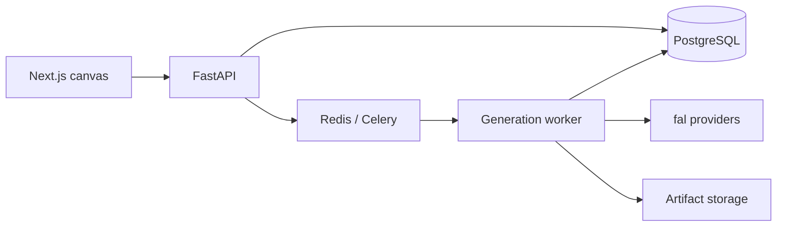

# Clai

> **Award-winning foundation:** Clai builds on work that won 1st place and the Best Use of Google Gemini award among 82 teams at Hack Western. [View the original project on Devpost](https://devpost.com/software/vril).

[](https://github.com/ericpungholee/clai-ai/actions/workflows/ci.yml)

Clai is a visual workspace for developing physical product concepts with generative AI. Each generation becomes an immutable point in a canvas-based edit history, so experiments stay visible, reproducible, and easy to branch.

## What it does

- Generates product concepts and applies instruction-based edits through fal.
- Connects prior images as a subject or as numbered visual references.
- Edits selected regions with brush, lasso, rectangle, and SAM-assisted masks.
- Preserves pixels outside masked edits with deterministic compositing.
- Branches from any saved image without changing the original result.
- Stores provider outputs locally or in S3-compatible object storage.
- Creates, previews, and exports textured 3D meshes.
- Persists durable run state through PostgreSQL, Redis, and Celery.

  

## Run it locally

You need Docker with Compose v2 and a [fal API key](https://fal.ai/dashboard/keys). Provider-backed actions use your fal account and may incur charges.

```bash
git clone https://github.com/ericpungholee/clai-ai.git
cd clai-ai
cp .env.example .env
```

Open `.env`, add your key as `FAL_KEY`, then start the application:

```bash
make dev
```

The backend applies database migrations during startup. Once the services are healthy, open:

- Web app: <http://localhost:3000>
- API documentation: <http://localhost:8000/docs>
- API health: <http://localhost:8000/health/ready>

Stop the stack with `make down`. PostgreSQL data and generated artifacts remain in local Docker volumes and ignored workspace paths.

## How it works



Submitting a run resolves its exact subject, references, mask, prompt, settings, and seed into a frozen database record. The worker executes that snapshot even if another browser tab changes the draft later. A successful run creates one immutable version; continuing an edit creates a new node linked to that version.

Provider files are validated and copied into Clai-owned storage before the result is committed. The default filesystem backend works without cloud infrastructure. S3-compatible storage is available through the variables documented in [.env.example](.env.example).

See [architecture.md](architecture.md) for the data model, provider routing, concurrency rules, storage boundaries, and known operational limits.

## Development

The Docker workflow is the shortest path to a consistent environment:

```bash
make lint             # Ruff, formatting, ESLint, and TypeScript
make test             # backend feature tests and frontend unit tests
make test-postgres    # migration and PostgreSQL invariant tests
make test-browser     # Playwright feature flows; requires local Node.js
make build            # production container builds
```

For host development, install Node.js 22+, Python 3.12+, and [uv](https://docs.astral.sh/uv/):

```bash
cd backend && uv sync && uv run pytest -m "not postgres"
cd ../frontend && npm ci && npm run lint && npm run typecheck && npm test
```

Browser tests use a local fake API and never call paid providers. The backend suite uses deterministic provider and storage doubles, with a separate PostgreSQL profile for database-specific behavior.

## Repository layout

```text
backend/
  app/api/          HTTP routes
  app/domain/       frozen run contracts and domain types
  app/providers/    fal provider adapters
  app/services/     graph, run, mask, and mesh workflows
  app/storage/      filesystem and S3-compatible ingestion
  alembic/          database migrations
  tests/            API, worker, provider, storage, and invariant tests
frontend/
  app/              Next.js routes
  components/graph/ canvas and editing UI
  lib/              API clients and browser-side codecs
  tests/            unit and Playwright feature tests
```

Clai is a portfolio project intended for local, single-user use. It does not include authentication, authorization, billing controls, rate limiting, or hosted deployment configuration.

Contributions are welcome; see [CONTRIBUTING.md](CONTRIBUTING.md). Security reports should follow [SECURITY.md](SECURITY.md).

## License

Released under the [MIT License](LICENSE).
