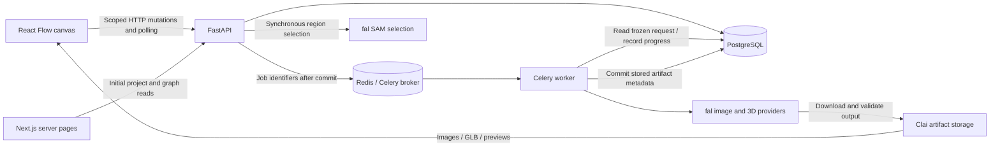
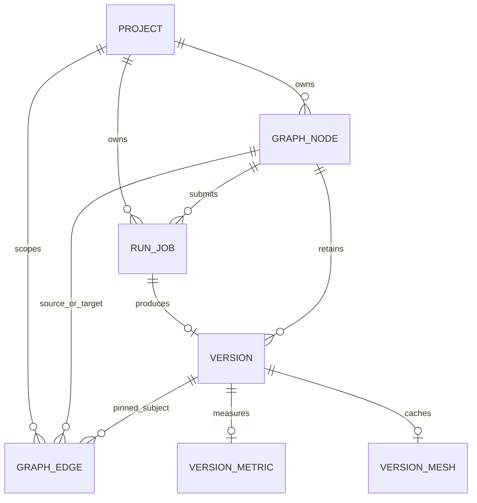
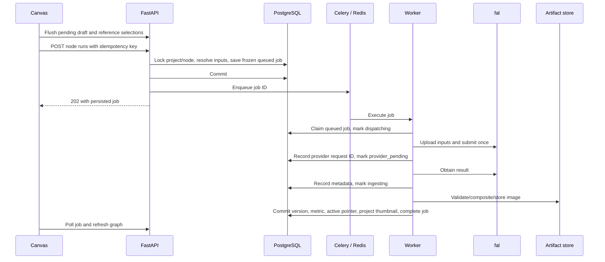

# Clai architecture

This guide describes the code inspected on September 6, 2026, including the existing local UI/export changes. It documents implemented behavior, not a proposed design. Provider identifiers describe the configured adapters; they are not claims about current provider pricing or capabilities beyond this code.

## 1. System model

Clai is a project-based canvas for generating and editing product images. Each canvas card is a `design` node. A new node is an editable draft; a successful run attaches one immutable image version and freezes its generation inputs. The result card’s “New node” action continues editing in another draft pinned to that image. Failed runs leave a draft retryable. Node titles and positions remain editable after generation; titles start empty and are never generated automatically.

The graph records image relationships and edit history. It is not a workflow scheduler: running a node resolves already-existing input images and does not execute upstream nodes. There is no general acyclic-graph restriction; self-connections are rejected. Explicit chain collapse is the only path that reads historical instructions to construct a new prompt.

## 2. Repository and process boundaries

| Location | Responsibility |
| --- | --- |
| `frontend/app/` | Next.js App Router pages, layout, global styling, loading and missing-project screens. |
| `frontend/components/projects/` | Project creation, tiles, rename/delete, and the canvas project name. |
| `frontend/components/graph/` | Canvas coordinator, cards, prompt chips, wires, dialogs, image/mesh viewers, selection tools, and exports. |
| `frontend/lib/api.ts` | Shared internal/browser API origins, JSON response handling, validation errors, and empty responses. |
| `frontend/lib/graph.ts` | API/React Flow types, scoped graph requests, graph-to-workspace conversion, wire numbering, and run blockers. |
| `frontend/lib/projects.ts`, `meshes.ts`, `mask-rle.ts` | Project requests, mesh requests, and the browser mask codec. |
| `backend/app/api/` | HTTP validation, project scoping, transaction boundaries, and queue handoff. |
| `backend/app/schemas/` | Pydantic request/response contracts. Mesh and selection contracts also live beside their routes. |
| `backend/app/models/` | SQLAlchemy persistence models and relational constraints. |
| `backend/app/domain/` | Immutable run snapshots, operation vocabulary, and structured prompt parts. |
| `backend/app/services/` | Graph mutations, input resolution/freezing, run and mesh execution, masks, and drift measurements. |
| `backend/app/providers/` | fal transport and Nano Banana Pro, FLUX Fill, SAM, and Tripo adapters. |
| `backend/app/storage/` | Filesystem/S3 stores, artifact readers, image ingestion, and GLB validation. |
| `backend/app/workers/celery_app.py` | Celery configuration, dependency construction, and image/mesh task entry points. |
| `backend/alembic/` | Ordered schema/data migrations, including PostgreSQL triggers. |

[Docker Compose](docker-compose.yml) starts PostgreSQL, Redis, the API, a worker, and Next.js. Backend and worker run the same application code in separate processes. The API applies Alembic migrations before becoming healthy; the worker waits for the API. Dependency environments are separate Docker volumes. The frontend has separate dependency and Next.js build-cache volumes.

## 3. Database model and invariants

See [graph models](backend/app/models/graph.py) and [project model](backend/app/models/project.py).

| Table | Meaning and important fields |
| --- | --- |
| `projects` | Name, creation/activity timestamps, latest successful generation thumbnail, and `deleted_at`. |
| `graph_nodes` | Project ownership, title, structured JSON prompt, settings, optional seed, position, revision, active image pointer, subject-bound mask, and deletion timestamp. |
| `graph_edges` | Source/target nodes within one project, `subject` or `connect` role, pin mode, optional pinned version, and reference order. |
| `run_jobs` | Node/project, idempotency key, frozen request, status, attempt count, provider request ID/payload, response metadata, errors, and stage timestamps. |
| `versions` | Immutable image URL/key/hash/type, originating run, provider/model/endpoint, parameters, seed, resolved input IDs/mask hash, runtime prompt, and edit depth. |
| `version_metrics` | One mutable measurement record per version, with method, status, value, and error. |
| `version_meshes` | One mutable mesh cache/job record per version, with attempt ID, texture mode, frozen source URL, provider state, GLB/preview URLs, and elapsed time. |

The database enforces same-project edge endpoints, version ownership for subject pins and active-image pointers, no self-edge, one subject per target, unique reference sources, unique reference positions, and valid role/pin combinations. PostgreSQL additionally enforces the two-reference cap with a trigger that locks the target node. The application validates contiguous reference order and synchronizes reference chips with their wires.

A PostgreSQL trigger rejects `UPDATE` and `DELETE` on `versions`; changing metrics or mesh state does not modify an image version. Each run can produce at most one version through a unique `run_job_id`. **One image per new node is enforced by submission and worker commit checks under locks**, not a unique constraint on `versions.node_id`: legacy nodes can retain multiple images.

The node's active-version foreign key is deferred to support the version/node relationship within a transaction. SQLAlchemy uses JSONB on PostgreSQL and JSON on SQLite. Tests using SQLite do not reproduce PostgreSQL row locking or triggers.

## 4. Frontend state and persistence

### Initial load and rendering

The [home page](frontend/app/page.tsx) reads projects on the Next.js server. The [project page](frontend/app/projects/[id]/page.tsx) awaits route parameters, fetches the project and graph without caching, and passes them to the client `GraphWorkspace`. Missing or invalid projects lead to the missing-project screen; graph-load errors show a retry-by-refresh view.

Server requests prefer `API_INTERNAL_URL`, then `NEXT_PUBLIC_API_URL`, then localhost. Browser requests use `NEXT_PUBLIC_API_URL`, defaulting to `http://localhost:8000`. Browser mutations go directly to FastAPI; there is no Next.js API proxy. Public environment values are bundled by Next.js, so the public API origin must be correct when building for deployment.

[Graph conversion](frontend/lib/graph.ts) hides deleted cards but uses retained versions to resolve surviving subject previews. References derive from the structured prompt document. Missing/deleted references remain represented as broken chips/wires so users can repair them. The canvas renders one custom node type (`DesignNode`) and one edge type (`RoleEdge`).

### Workspace coordinator

[GraphWorkspace](frontend/components/graph/graph-workspace.tsx) owns React Flow nodes/edges, selection, dialogs, asynchronous saves, polling, deletion, and run submission. `DesignNodeActionsContext` supplies actions to nested cards, prompts, and wires without putting persistence into each component.

React state renders the UI; refs keep current nodes, edges, pending patches/documents, and outstanding promises available to asynchronous callbacks. Pan/zoom, selection, dialog state, and loaded mesh-preview mode are local. Node positions persist when dragging settles. The application does not save the viewport or provide whole-canvas undo.

### Saves and conflicts

1. Title, prompt, and setting edits update local state immediately. Autosave uses a 500 ms debounce.
2. Per-node promise chains serialize saves. Ordinary field patches and prompt-document saves are tracked separately.
3. Node PATCH can include `expected_revision`; prompt PUT requires it. Successful patches/prompts increment the node revision. A stale revision returns HTTP 409 and retains the local draft with recovery actions.
4. If both a patch and prompt are pending, the client saves the patch first and uses its returned revision for the prompt.
5. Every 3 seconds while the tab is visible, the workspace fetches the full graph. A sequence counter ignores older overlapping responses. Merging preserves pending edits, dragging, selection, and local mesh presentation.
6. A remotely deleted node with unsaved text remains locally visible for recovery. A newly completed result clears pending generation-input edits because its inputs are now frozen.
7. Recovery can reload the saved draft or rebase the local pending values onto the newest revision and save them. Pending work also activates navigation/unload protection.

Revision checks are not universal optimistic concurrency: mask and subject endpoints use project/node locks and lifecycle guards but do not carry `expected_revision`. Polling is synchronization across tabs, not realtime collaborative editing or offline persistence.

## 5. Prompt documents and input relationships

The database `graph_nodes.prompt` column contains an ordered array, despite its name. Text parts have `{type: "text", text}`; reference parts have `{type: "connect", edge_id, source_node_id}`. The response includes both this `document` and a plain display `prompt` where references become `@`.

The [prompt editor](frontend/components/graph/prompt-editor.tsx) manages editable text and non-text reference chips. Inserting `@` or drawing a reference wire updates the same document. [update_prompt](backend/app/services/graph_service.py) validates and replaces its reference edges in the same transaction, avoiding independent chip/wire saves. It limits a prompt to 8,000 text characters, two references, unique sources/edge IDs, and no self-reference.

| Input | Resolution at submission | Effect of later source changes |
| --- | --- | --- |
| Subject / solid input wire | Exact `pinned_version_id`; supplies image 1. | Existing pins retain the image even if the source selects another legacy image or its card is deleted. |
| Connect / dashed reference wire | Source node's current active version, in prompt order. | A draft follows selection changes; a frozen job keeps the version resolved at submission. Deleted or empty sources block a new run. |

[compile_document](backend/app/domain/prompts.py) replaces chips with `image 1`, `image 2`, etc. References start at 2 when a subject occupies image 1. Provider uploads use the same subject-first/reference-order sequence. Node titles label UI inputs but are not added as hidden prompt context.

New nodes default to 1:1, 1024×1024, White bg on, and no explicit seed. These settings remain in the API; the current UI has no White bg toggle. Continue editing inherits the source node's settings unless a branch request overrides them. Seed resolution chooses the draft seed, then subject seed, then a random 32-bit value. Duplicate requests copy draft inputs, references with new edge IDs, mask, and settings; the API supports `fresh_seed`, while the current UI exposes ordinary draft duplication only.

## 6. Image generation lifecycle

The implementation spans [run submission](backend/app/services/run_jobs.py), [freezing](backend/app/services/run_freezing.py), [input resolution](backend/app/services/run_resolution.py), [codec](backend/app/services/frozen_request_codec.py), and [execution](backend/app/services/run_execution.py).

### Submission and freezing

The API acquires a project mutation lock before inspecting graph state. This gives input resolution a coherent snapshot and avoids opposing lock orders when nodes reference each other. A repeated `(node_id, idempotency_key)` returns the existing job. A different key also reuses an in-flight job on the node. A node with any image cannot submit another run.

Freezing validates chip/wire agreement, resolves input versions and seed, validates/normalizes the mask, selects an operation, builds the runtime prompt, computes edit depth, and serializes these values into `run_jobs.frozen_request`. The snapshot includes input artifact URLs and image metadata, the user prompt, runtime prompt, settings, mask, and input identifiers. Workers use this snapshot, not the current editable graph.

The route commits before enqueueing. An observed enqueue failure marks a still-queued job failed and returns 503; if the worker already advanced the job, the route returns its recorded state instead. The database is the source of displayed progress, not Celery's result backend.

### Operation routing and provider payloads

| Inputs | Operation | Adapter / configured endpoint |
| --- | --- | --- |
| No subject or references | `generate` | Nano Banana Pro: `fal-ai/nano-banana-pro` |
| References, no subject | `generate_ref` | Nano Banana Pro edit endpoint: `fal-ai/nano-banana-pro/edit` |
| Subject only | `edit_instruct` | Nano Banana Pro edit endpoint |
| Subject and references | `edit_ref_guided` | Nano Banana Pro edit endpoint |
| Subject and partial mask | `edit_inpaint` | FLUX Fill: `fal-ai/flux-pro/v1/fill` |

`edit_composite` remains in domain/schema/database vocabulary, but public mutations and submission reject masks combined with references, and no enabled adapter executes that combination. It should not be removed from historical contracts as unused text.

[Prompt construction](backend/app/services/prompt_builder.py) uses only the current resolved instruction. Edits prepend preservation instructions for unnamed attributes. White bg adds a pure-white instruction to generation and unmasked edits; masked edits omit that global background clause. Turning White bg off makes the edit preamble preserve the background.

Nano Banana uploads Clai-owned input bytes to fal, requests one PNG, maps the largest requested dimension to 1K/2K/4K, forwards seed/aspect ratio, and disables web search. FLUX uploads the subject and a generated mask PNG and disables prompt enhancement. [Fal transport](backend/app/providers/fal_transport.py) performs one queue POST per submission and records its returned request ID; it does not automatically retry a paid POST.

### Worker commit and failure behavior

Status progresses through `queued → dispatching → provider_pending → ingesting → complete`, with failures recorded as `failed`. Claiming requires `queued` and increments `attempts`. Duplicate deliveries cannot resubmit a job that has already advanced. Provider setup failures are also recorded before generation starts.

The commit transaction locks the project/job/node, returns an existing version for the same job if present, rejects a second image on the node, then inserts the version and optional metric. It selects the new image and updates project activity/thumbnail. It does not auto-name the node.

The browser polls a submitted image job every 750 ms; graph polling restores persisted progress after reload. A polling error continues checking the existing job instead of automatically submitting another.

Durable state does not mean automatic recovery: there is no outbox publisher, reconciliation service, cancellation endpoint, or provider-request resume workflow. A process crash between commit and enqueue can leave a queued row without a task; a crash after claim can leave a nonterminal job. A provider submission may succeed before its request ID is persisted. These cases require inspection, and automatic paid retries are intentionally absent.

## 7. Area selection and pixel preservation

[MaskEditor](frontend/components/graph/mask-editor.tsx) draws brush/lasso/rectangle/erase selections in image coordinates, with local undo. Browser and Python codecs use one-based, row-major start/length RLE pairs. Separate codecs are necessary because selections are edited in the browser and validated/composited in Python.

Click/text selection calls the API synchronously, rather than creating a Celery run. The API validates project/version ownership and click bounds, reads the stored image, uploads it to `fal-ai/sam-3/image-rle`, unions returned masks, and returns RLE. Selection does not generate an edited image.

Saving a mask verifies the editable node, its pinned subject version, RLE validity, and actual image dimensions. Masks bind to exact subject version IDs. A stale mask blocks a run; references and saved selections exclude each other. Empty masks are rejected; a full-image selection normalizes to an unmasked edit during input resolution.

For partial masks, [compositing](backend/app/services/masks.py) resizes provider output to the original dimensions if necessary, applies generated pixels within the selection, and blends a three-pixel outer band. Pixels beyond that band come from the original. The stored output is PNG. A normalized outside-band pixel difference is recorded as `outside_feather_pixel_diff` and exposed on graph versions for display.

Unmasked edits have no equivalent pixel-preservation guarantee. An optional external DINOv2 scorer receives temporary subject/output files and returns a value in [0, 1]. With no configured command the measurement stays pending. Scorer command failures become failed metrics rather than failed image generations. The repository supplies the integration and offline regression report, not a bundled DINOv2 model.

## 8. Image history, continuation, deletion, and collapse

New results have one image. Legacy nodes can contain multiple immutable versions and retain a selection-only strip; they cannot generate additional images. Selecting a legacy image changes the active pointer and therefore future reference resolution. A result cannot clear its active image.

Continue editing uses the branch endpoint to create a new draft and subject edge atomically. It inherits settings and starts with an empty title/prompt by default. It can branch from a retained image whose original card was deleted. Draft duplication copies setup without copying versions or an active image pointer.

Node deletion is physical only when no outgoing dependents or run history require retention. Otherwise `deleted_at` hides the card and retains history. Project deletion sets `deleted_at` and removes normal access without deleting its records. Artifact files are not garbage-collected. Already queued worker jobs are not cancelled by deleting a card/project.

[Collapse preview](backend/app/api/versions.py) traverses recorded subject-version IDs, collects original user instructions from frozen jobs, and reverses them into chronological order. It requires at least two plain `edit_instruct` steps, rejects cycles, masked/reference edits, missing instructions, and prompts above 8,000 characters. A narrowly matched legacy prompt envelope supports older runs. The dialog lets the user edit the combined instruction, creates a branch against the root, and submits an ordinary run; it does not rewrite old versions or inject ancestor prompts into other runs.

Image inspection displays original stored assets and supports two-pane comparison. `DownloadButton` fetches the artifact bytes into a Blob, derives a filename/extension, and downloads them without canvas re-encoding. The same control exports completed GLB models. For remotely hosted artifacts, the browser needs the storage host's CORS policy to permit these fetches.

## 9. 3D generation and caching

The [mesh API](backend/app/api/meshes.py) addresses one exact image version. GET returns its cache/job or null. POST accepts an attempt UUID and texture mode, locks the image row, freezes its artifact URL, persists a queued cache record, and then enqueues a mesh task.

An existing attempt or nonfailed cache is reused. A completed textureless mesh may be upgraded to `standard`; failed attempts can be explicitly retried with a new attempt ID. Upgrades reuse/reset the cache row, so there is no separate durable history of previous mesh attempts.

[TripoProvider](backend/app/providers/tripo.py) uploads the source image and calls `tripo3d/tripo/v2.5/image-to-3d`. Standard texture requests enable PBR, original-image texture alignment, and image-aligned orientation. The [mesh worker](backend/app/services/mesh_jobs.py) claims only the matching queued attempt, records provider progress, validates/stores output, and updates the cache. Mesh failures leave the 2D version unchanged.

[GLB validation](backend/app/storage/meshes.py) checks the header/version/declared length and JSON chunk, rejects external buffer/image URLs, and requires a material-linked embedded color texture for textured jobs. It is application-level validation, not a complete glTF conformance checker. Optional preview images are decoded and verified before storage.

`MeshViewer` polls every two seconds while waiting and dynamically loads the Three.js scene in the browser. OrbitControls allows continuous 360° rotation and top/bottom inspection; Reset view restores the front camera. The source-image panel retains logo selection, placement, size, rotation, and removal controls without explanatory text blocks. Logo crops are projected onto the mesh and retained for the workspace session; GLB export contains the saved mesh only. Completed previews can be shown on the card during the session. Closing the modal stops its polling but leaves worker execution running. The model is an inferred visualization, not editable CAD geometry.

## 10. Artifact storage

[Storage factories](backend/app/storage/factory.py) construct an `ArtifactStore`, a reader for Clai assets, and a separate provider-output reader.

| Mode | Writes | Reads and serving |
| --- | --- | --- |
| Filesystem (default) | Content-hashed keys below `ARTIFACT_STORAGE_PATH`, temporary file, fsync, atomic replace. Existing differing bytes are rejected. | Worker/API resolve only URLs under `ARTIFACT_PUBLIC_BASE_URL` into safe local paths. FastAPI mounts `/artifacts`. |
| S3-compatible | Content-hashed keys, content type, SHA-256 metadata, immutable cache-control. | Public base URL must serve the objects over HTTPS; readers allow that hostname. FastAPI does not mount local artifacts in this mode. |

Image downloads permit only configured HTTPS hosts, disable redirects, and cap bytes at 32 MiB. Mesh output downloads use 128 MiB. Image ingestion verifies PNG/JPEG/WebP bytes instead of trusting provider MIME labels. Stored versions point to Clai-owned artifacts, not expiring provider result URLs. Input providers read those stored bytes and upload them to fal when needed.

Compose shares the backend bind mount between API and worker, including the default `.data/artifacts` directory relative to `/app`. A custom filesystem path must likewise be shared. In S3 mode the public origin/prefix must map to the actual stored keys; the application does not provision buckets or hosting policies.

Storage writes precede database commit. A later commit or metric failure can leave an unreferenced artifact; there is no cross-storage transaction or cleanup worker. S3 content addressing is not S3 Object Lock, and direct bucket/filesystem modifications sit outside the application's immutability rules.

## 11. HTTP surface

All project-scoped paths below are relative to `/api/projects/{project_id}`. Bodies and response schemas are available in FastAPI's generated `/docs`.

| Method and path | Purpose |
| --- | --- |
| `GET/POST /api/projects` | List live projects / create a project. |
| `GET/PATCH/DELETE /api/projects/{project_id}` | Read / rename / soft-delete a project. |
| `GET /graph` | Full graph with retained nodes, versions, branch links, masked metrics, and latest runs. |
| `POST /nodes` | Create a draft. |
| `PATCH/DELETE /nodes/{node_id}` | Update scoped fields / remove or retain a node. |
| `POST /nodes/{node_id}/duplicate` | Copy setup and incoming inputs without results. |
| `PUT /nodes/{node_id}/prompt` | Save prompt parts and reference edges atomically. |
| `PUT/DELETE /nodes/{node_id}/subject` | Set or disconnect the pinned input image. |
| `PUT /nodes/{node_id}/mask` | Save or clear a subject-bound selection. |
| `POST /versions/{version_id}/selection` | SAM selection; returns mask data without saving it to a node. |
| `POST /versions/{version_id}/branches` | Create a draft pinned to this image. |
| `GET /versions/{version_id}/collapse-preview` | Inspect whether/how a plain edit chain can be collapsed. |
| `GET /nodes/{node_id}/run-preview` | Resolve/validate inputs and return the operation; retained API, currently unused by the UI. |
| `POST /nodes/{node_id}/runs` | Freeze and enqueue an image job. |
| `GET /runs/{job_id}` | Read database-backed job progress. |
| `GET/POST /versions/{version_id}/mesh` | Read cache / request 3D or a supported texture upgrade. |
| `GET /health`, `GET /health/ready` | API liveness / database and Redis connectivity (outside project scope). |

The API sanitizes request-validation errors to type/location/message. Mutation conflicts generally return 409, invalid graph inputs 422, missing scoped resources 404, and queue unavailability 503. Full graph serialization enriches nodes with derived runs, branches, and metrics; individual node responses are simpler, so the client refreshes for authoritative derived state.

## 12. Configuration and operational boundaries

[Settings](backend/app/core/config.py) load `.env`, ignore extra fields, and cache the settings instance. `DATABASE_URL` is required. `REDIS_URL` selects the Celery broker/result backend. `FAL_KEY` is required for real image generation, SAM, and 3D. `FAL_TIMEOUT_SECONDS`, `FAL_OUTPUT_HOSTS`, artifact settings, optional drift command/timeout, and `CORS_ORIGINS` control the integrations. S3 mode requires bucket, access key, and secret key, with optional endpoint/region.

[README](README.md) and [Makefile](Makefile) provide local commands. Apply the complete Alembic chain; do not delete old revisions because later revisions depend on them, even when a feature such as image visibility has been retired. The current head, `c9512e4a731b`, restores an active image on older hidden nodes and drops obsolete visibility preferences without deleting versions.

There is no authentication, ownership/authorization model, billing, rate limiting, sharing, or hosted deployment configuration. CORS is not access control. Readiness verifies PostgreSQL and Redis, not fal credentials, worker availability, or artifact storage. The implementation has no run-all scheduler, automatic provider fallback, cancellation, realtime presence, or artifact retention sweeper.

## 13. Validation and repository maintenance

Runtime imports, exported symbols, CSS selectors, dependency manifests, and file contents were audited. Application modules and dependencies remain in use; no identical nonempty production files were found. The unused empty Next.js configuration was removed. Database migrations and compatibility paths for retained images remain necessary.

Tests, benchmark runners, timing reports, and saved performance baselines are local-only and are not part of the git tree. `make test` runs frontend lint and type checking. `make lint` covers application Python and frontend lint. `make benchmark` remains available locally when those scripts are present.

`GraphWorkspace` still coordinates saves, polling, merges, and actions. All of those paths are active; splitting them is a separate behavioral refactor. Full-graph refreshes read retained history, so large projects may eventually benefit from pagination or incremental synchronization.
