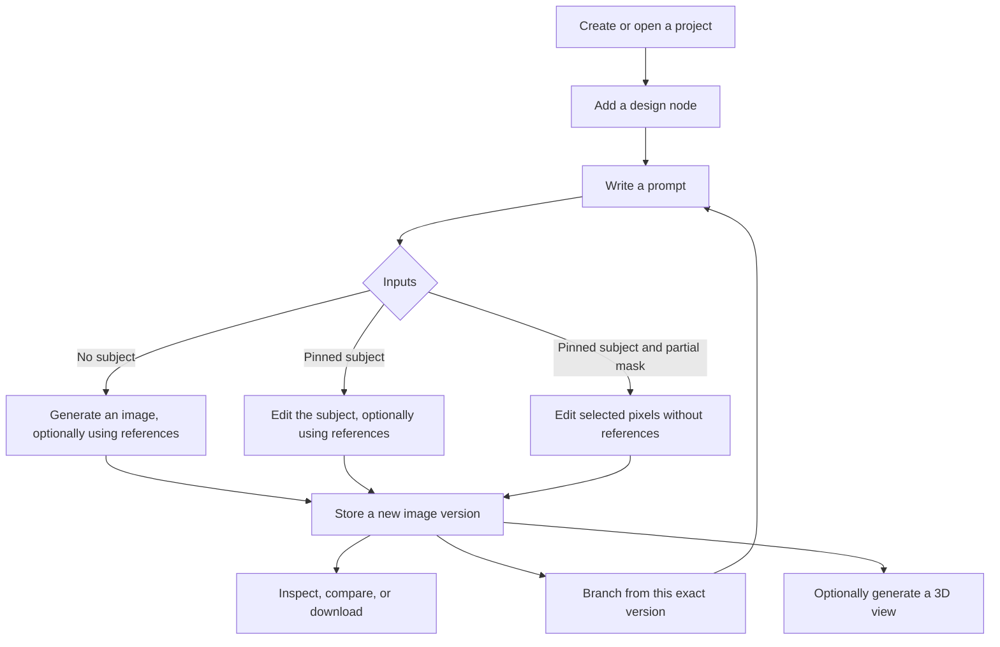

> Historical implementation notes. The current lifecycle is documented in [One node, one image](node-lifecycle/README.md).

# Clai canvas, AI, and node workflows

Detailed user guide and current implementation assessment, inspected **September 4, 2026**.

This guide describes the current working tree, including local changes on top of commit `c0016f0`. It covers the controls that exist, how to use them, what each action changes, and where a workflow stops. The code is the authority for labels and behavior; some older repository descriptions use different labels.

**“Implemented” means there is a working application path in the inspected code.** Automated verification and its limits are recorded under [Verification](#verification). Image generation, AI selection, and 3D generation still require configured services and successful provider responses. No paid provider calls were made to prepare this document. Displayed prices below are application text, not independently verified current provider prices.

## Contents

- [Product model and terminology](#product-model-and-terminology)
- [Projects and entering the canvas](#projects-and-entering-the-canvas)
- [Canvas navigation and controls](#canvas-navigation-and-controls)
- [Design nodes and every node control](#design-nodes-and-every-node-control)
- [Prompt editing and AI context](#prompt-editing-and-ai-context)
- [Subject and reference connections](#subject-and-reference-connections)
- [AI generation, editing, and running again](#ai-generation-editing-and-running-again)
- [Masks and area editing](#masks-and-area-editing)
- [Versions, branching, and duplication](#versions-branching-and-duplication)
- [Inspecting, comparing, and downloading images](#inspecting-comparing-and-downloading-images)
- [Collapsing an edit chain](#collapsing-an-edit-chain)
- [3D generation and viewing](#3d-generation-and-viewing)
- [Saving, synchronization, and deletion](#saving-synchronization-and-deletion)
- [Complete example workflows](#complete-example-workflows)
- [What works now and what does not](#what-works-now-and-what-does-not)
- [Troubleshooting by symptom](#troubleshooting-by-symptom)
- [Verification](#verification)
- [Implementation source map](#implementation-source-map)

## Product model and terminology

Clai is a node canvas for creating and iterating on images of physical products. A project contains design nodes connected by image inputs. Every successful image run adds a version to one node. You can inspect that version, use it as an input, branch from it, or generate an associated 3D view.

There is **one canvas node type: Design**. A generation node and an editing node are the same component with different inputs. A mask belongs to a node's subject input. A 3D model belongs to an image version. Neither is a separate canvas node.

| Term | Meaning in this application |
| --- | --- |
| Project | A saved canvas and its nodes, connections, jobs, and image history. |
| Design node | An editable title, prompt, settings, optional image inputs, and output history. |
| Draft | The node's current prompt and input configuration for a future run. |
| Version | An immutable image result with a recorded prompt, inputs, seed, provider, and operation. |
| Active version | The image currently selected on a node. Other versions remain in its history. |
| Subject | The exact image being edited. A subject connection pins a specific version. |
| Reference / connect | An additional image mentioned inside the prompt. It follows the source node's active version. These are two names for the same input role. |
| Chip | The numbered `@Node title` token inside a prompt that creates a reference connection. |
| Mask / area selection | The pixels of the pinned subject where a local edit is allowed. |
| Run | A saved job using a frozen snapshot of one node's inputs. |
| Branch | A new node whose subject is a chosen image version. |
| Duplicate draft | A new node copying another node's editable setup and incoming connections. |
| Edit depth | The number of subject-based edit steps leading to an image. It is separate from its version number within a node. |
| 3D view | A generated model associated with one exact 2D version. |

The canvas is not executed as a whole. Running a node reads already existing input images. It does not automatically run upstream nodes, update downstream outputs, or walk the entire graph.

## Projects and entering the canvas

### Create and open a project

1. Open the home page, labeled **Projects**.
2. Click **New Project**. The button reads **Creating…** while the request is pending.
3. Clai creates **Untitled Project** and opens its empty canvas.
4. The empty canvas says **Start with one object**. Click **Add node** to create the first design node.
5. Enter a prompt and run it, as described below.

Existing projects appear as tiles with a name, thumbnail when available, and update time. Click the tile to open its canvas. The project thumbnail comes from the most recently completed image run in the project; it is not a screenshot of the canvas or a live preview of whichever historical image you select.

### Project controls

| Control | Location | Action and conditions |
| --- | --- | --- |
| **New Project** | Home header; also in the empty-project message | Creates a project immediately with the default name and opens it. There is no initial configuration wizard. |
| Project tile | Home grid | Opens that project's canvas. |
| **Rename** | Beneath a project tile | Opens an inline name field. |
| **Project name** field | Inline rename form | Accepts up to 120 characters. A trimmed, nonblank name is required. |
| **Save** | Rename form | Saves the name; Enter submits the form. Disabled for a blank name or while saving. |
| **Cancel** | Rename form | Closes the form without submitting. Escape also closes it and resets the local field to the saved name. |
| **Delete** | Beneath a project tile | Opens a browser confirmation, then removes the project from the active list. Its images and history are retained. |
| **← Projects** | Canvas header | Returns to the home page. If draft saves are pending, asks before leaving. |

The name in the canvas header is display text. Rename the project from the home page. There is no project search, folder system, project duplication, sharing interface, trash view, or project-restore button.

## Canvas navigation and controls

### Moving around

| Interaction | Result |
| --- | --- |
| Drag a node's noninteractive area, such as header space | Moves the node. Its position saves when the drag ends. Title fields, prompt editors, and buttons have their own interactions. |
| Drag empty canvas with the primary mouse button | Draws a selection region. |
| Hold **Shift** while selecting | Supports multiple selection. |
| Hold **Space** and drag | Pans the canvas. |
| Drag with the middle or right mouse button | Pans the canvas. Right-drag is a navigation gesture; there is no custom right-click action menu. |
| Wheel/pinch navigation | Uses React Flow's zoom behavior. The canvas zoom range is 10%–200%. |
| Click empty canvas | Gives the workspace focus for its shortcuts. |
| Click a prompt chip or a version's dependent-node link | Selects and centers the corresponding node at 100% zoom. |

The dotted background is a visual guide. Nodes do not snap to it. New nodes are placed near the current viewport center; branches and duplicates are placed near their source. Placement searches for available space but is not a full automatic layout system.

### Visible canvas controls

| Control | Location | Behavior |
| --- | --- | --- |
| **Add node** | Empty-state panel, or upper-left canvas panel once nodes exist | Creates one empty design node, selects it, and centers it. |
| **Zoom in** | React Flow controls, lower left | Increases canvas zoom. |
| **Zoom out** | React Flow controls, lower left | Decreases canvas zoom. |
| **Fit view** | React Flow controls, lower left | Fits the graph into the available viewport. **F** also fits it, using the workspace's fit options. |
| **? / Keyboard shortcuts** | Lower right | Has a tooltip listing shortcuts. **It currently has no click handler and opens no help dialog.** |
| Save-status dot | Header | Indicates saved, saving, or failed state. Hover/focus-accessible text identifies the state. It is not a Save button. |
| Connection warning banner | Below header when needed | Reports interrupted refreshes or unavailable run status. Polling continues. |

### Keyboard reference

| Shortcut | Context | Result |
| --- | --- | --- |
| **N** | Canvas focused | Add a design node. |
| **B** | Canvas; selected node has an active image | Branch from that active image. |
| **Cmd/Ctrl + D** | Canvas; node selected | Duplicate its draft. With several nodes selected, this custom action uses the first selected node. |
| **F** | Canvas | Fit graph. |
| **Shift** | Canvas selection | Multiple selection. |
| **Space + drag** | Canvas | Pan. |
| **Delete / Backspace** | Canvas | Remove selected nodes or wires, with confirmation where applicable. |
| **Cmd/Ctrl + Enter** | Prompt editor, or canvas with a selected node | Run that node, subject to validation and unchanged-input protection. |
| **@** | Prompt editor | Open the reference picker at the caret. |
| **Enter** | Prompt editor | Insert a newline. |
| **Enter** | Reference-picker search field | Insert the first matching candidate if fewer than two references are present. |
| **Escape** | Reference picker | Close the picker and return focus to the prompt. |
| **Enter** | Focused reference chip | Find its source on the canvas. |
| **Delete / Backspace** | Focused chip, or caret immediately beside a chip | Remove the whole chip and its wire. |
| **Enter / Space** | Focused connection handle | Activate it for click-to-connect; activate a compatible target handle to finish. |
| **Escape** | Overflow menu | Close the menu and return focus to its trigger. |
| **Escape** | Image, mask, collapse, or 3D dialog | Close the dialog; mask selection/saving blocks closing while busy. |
| **Escape** | Canvas | Clear the current wire-hover highlight. |

Canvas shortcuts are suppressed while typing in an input, textarea, select, or editable prompt, and while a modal dialog is open. The prompt editor handles its own run shortcut. Deletion keys do not delete canvas nodes while an image or editing dialog is active.

Node positions persist. Viewport position, zoom, selection, open dialogs, and hover state do not have a saved project-level representation. There is no canvas undo/redo, grouping, layers, minimap, alignment toolbar, or automatic layout button.

## Design nodes and every node control

### Reading a node from top to bottom

1. **Header:** editable title, save-status dot, and three-dot **Node actions** menu.
2. **Preview, after this node produces an image:** the active output. A new draft has no main image; its pinned input remains in the subject row. A saved 3D preview can replace a completed result.
3. **Image toolbar:** appears when the preview is hovered or focused.
4. **Subject row, on edit nodes:** image number 1, a thumbnail, and the source title.
5. **Warning line, when needed:** input problems, draft-save problems, or a failed run.
6. **Prompt editor:** text plus optional reference chips.
7. **Prompt footer:** White bg and Run, or run progress while running.
8. **Version strip:** appears with two or more versions, or when any version is hidden.

The main image is fitted inside a 4:3 preview area with `object-contain`; it is not a new cropped output. Version thumbnails use a cropped presentation. Inspect opens the stored original.

### Header and prompt controls

| Control | Availability | Effect |
| --- | --- | --- |
| **Node title** field | Every node | Changes the display name, up to 120 characters. Nonblank edits autosave. Renaming updates reference and subject labels; the title is not additional AI context. |
| Save dot | Every node | **Saved** = gray; **Saving…** = amber; **Save failed** = red. Hover text and accessible labels expose the state. |
| **Node actions** three-dot button | Every node | Opens context-dependent actions described below. |
| **Design prompt** | Every node | Editable multiline text and references. Placeholder is **Describe an object…** without a subject and **Describe a change…** with one. |
| **White bg** icon toggle | Every editable draft, while not running | Toggles a white-background instruction for generation or editing. On by default for every new node. It is not a transparency control or background-removal tool. |
| **Run** | Prompt footer while not running | Saves the draft, validates inputs, and submits one image job. Disabled for blocked inputs or an active version generated from unchanged inputs. Hover its disabled state to read the reason. |
| **Retry** | Failed-run warning when current inputs are runnable | Tries a new run. Uses Run again when the current inputs already match an active version. |
| Run stage and elapsed time | Prompt footer while running | Replaces the normal footer controls until the run settles. |

A title cleared to whitespace is not scheduled for saving. After a successful run, an untouched **Untitled concept** title is shortened from the node's current prompt document: reference chips contribute their source titles, a leading `image N` marker is removed, and the first five words are kept, capped at 60 characters. If no usable title remains, it stays Untitled concept. A custom title is preserved. This display-name step reads the current draft; the generated image still uses its frozen run prompt.

### Image and subject controls

| Control | Availability | Effect |
| --- | --- | --- |
| Click main image | The node has produced a result | Opens result inspection. If the card is showing a 3D preview, opens the 3D viewer instead. |
| **Inspect** icon | Result preview toolbar | Opens the original 2D result. It still opens 2D when the card is showing a 3D preview. |
| **Branch** icon | Node has an active output | Creates an empty-prompt child node pinned to that output. |
| **Select area** icon | Node has a subject and no saved mask | Opens the subject's mask editor. |
| **Edit mask** icon | Node has a subject and saved mask | Opens the mask editor with the compatible saved selection. |
| **3D** icon | Node has an active output | Opens the mesh cache/view for that exact version. Opening alone does not generate a model. |
| **2D image** icon | A matching 3D preview is available in the current session | Switches the card back to its original image. |
| **3D preview** icon | A matching 3D preview is available | Switches the card to the static mesh preview. |
| **N edits** badge | Active output has edit depth at least 2 and node has a subject | Opens chain-collapse preview. At depth 5 or greater, the tooltip warns about loss of identity through long chains. |
| Subject thumbnail/title | Node has a subject | Inspects the pinned source image. Hover/focus highlights the corresponding wire. |

The subject row is always the input image and provides its own Inspect and Select area / Edit area controls. It does not fill a new node's main preview. After a run, the main preview shows only that node's result while area controls continue to target the pinned input. To edit an area of the new output, branch from the output first.

For a completed masked edit, the Inspect tooltip also reports pixel preservation outside the selection and 3px seam. A zero measurement says those pixels were preserved exactly. This is a preservation measurement, not a judgment of whether the requested edit looks correct.

### Node actions menu

| Menu item | When shown | Behavior |
| --- | --- | --- |
| **Run again** | Current inputs are not blocked | Explicitly requests another image with a fresh submission seed, even if the draft has not changed. May ask about downstream references. |
| **Duplicate draft** | Always | Saves pending edits, then creates a copy of the draft and incoming wiring. Does not copy output history. |
| **Hide** | There is one version and it is active | Hides that version. It remains retained and becomes accessible through the retained-version control. |
| **Used by [node title]** | Single active version has live subject dependents | Jumps to the named dependent node. |
| **Collapse chain** | No current subject, but active output records edit depth at least 2 | Opens collapse preview for that historical result. On ordinary edit nodes, the preview badge provides this action. |
| **Delete node** | Always | Removes the card; may ask for confirmation based on history, dependents, or unsaved changes. |
| **Disconnect subject** | Subject's source node was deleted | Removes the retained subject pin; asks before clearing a saved mask. A live subject is normally disconnected through its wire. |
| **Keep my draft** | Draft save/conflict error; node still exists remotely | Reloads the latest revision and retries pending local changes. |
| **Use saved draft** | Draft save/conflict error; node still exists remotely | Confirms discarding local changes, then loads the saved draft. |
| Status/error text | Always or when an error exists | Shows save status or the detailed draft error. This row is informational. |

The **Resolve draft** overflow next to a draft warning exposes the same Keep my draft and Use saved draft actions. There is no separate node settings inspector or right-click node menu.

## Prompt editing and AI context

### Write a prompt

For a new object, describe the object and the desired image: for example, `A compact desk lamp with a cylindrical base, a curved stem, and a brushed aluminum shade, photographed from the front left.`

For an edit, describe the requested changes: for example, `Change the shade to matte navy blue. Keep the base and camera angle.` The backend automatically adds preservation instructions to subject-based edits. Explicit changes to shape, proportions, material, color, and finish are allowed; preserving unmentioned attributes remains model-dependent for an unmasked edit.

The prompt supports multiline plain text and atomic reference chips. Pasting inserts **plain text**. It does not import an image, preserve rich formatting, or turn pasted `@Name` text into a real connection.

Prompt saves enforce a combined text limit of 8,000 characters and a document limit of 128 parts. The editor itself does not display a character counter or limit typing to 8,000 characters; an oversized draft can fail to save. Up to two parts may be reference chips.

### Insert and use a reference chip

1. Place the caret where the reference should appear in the sentence.
2. Type **@**. The **Connect a concept** picker opens.
3. Type in **Find a concept** to filter nodes by title.
4. Click a result, or press Enter to choose the first match.
5. Clai inserts a numbered chip and creates its wire. Continue typing around it.
6. Use **Cancel** or Escape to close the picker without inserting.

Example: `Use the material from [@Material study] for the lamp shade.` The brackets here illustrate a chip; typing bracketed text does not create one.

The current node and already referenced nodes are excluded from the picker. A source without an image can be selected, but the target cannot run until that source has an active image. With two references, the picker says **Two connect chips maximum. Remove one first.** There is no third-reference slot.

### Chip controls

| Interaction | Effect |
| --- | --- |
| Hover/focus a chip | Highlights its wire and connected cards; other wires dim. |
| Click a chip or press Enter while focused | Finds its source node on the canvas. This opens no image inspector. |
| Backspace immediately after, Delete immediately before, or Delete/Backspace while focused | Removes the chip as one item and removes the wire. |
| Edit surrounding text | Changes the instruction; the chip remains a separate reference object. |
| Remove a reference wire | Removes its matching prompt chip and renumbers remaining inputs. |

Chip labels abbreviate long node names. Hover text distinguishes **Click to find on canvas**, **Run the source node first**, and **Source deleted — remove or replace this chip**. A deleted source receives broken styling.

There is no separate reference-reordering panel. Reference order is their order in the prompt; to change their placement predictably, remove and reinsert them at the desired caret positions.

### Exactly what reaches the AI

| Context | Included in an ordinary image run? |
| --- | --- |
| Current target prompt text | Yes, compiled with image-number substitutions for real chips. |
| Subject image | Yes, if connected; it is image 1. |
| Reference images | Yes, in chip order, resolved to their active versions when the job is submitted. |
| Saved partial mask | Yes, on the inpainting path, bound to the subject version. |
| White-background setting | Adds an instruction only for generation operations. |
| Node title / project title | No extra instruction is created from these labels. |
| Reference source's prompt | No. The reference contributes its image, not its prompt or history. |
| Ancestor prompts | No automatic replay. Explicit chain collapse is the separate workflow that reads historical instructions. |
| Unconnected nodes / whole canvas layout | No. Proximity and visual arrangement do not provide model context. |
| Current node's previous output | Only if explicitly made an input through another node/branch; it is not automatically the next subject. |
| 3D preview or rotated model | No. Image connections continue to use the original 2D image version. |
| Web search or chat history | No application chat context; the image adapter explicitly disables web search. |

Without a subject, two references are images **1** and **2**. With a subject, it is image **1**, and references are images **2** and **3**. The sentence `Use the finish from [@Material study]` becomes `Use the finish from image 2` when a subject occupies image 1. Source labels are not sent as extra descriptions.

## Subject and reference connections

### How the two roles differ

| Property | Subject | Reference / connect |
| --- | --- | --- |
| Purpose | The image to edit | Additional image context for an instruction |
| Incoming limit | One | Two, from distinct source nodes |
| Image selection | Exact version pinned at connection time | Active source version at each run submission |
| Wire | Solid blue, filled endpoints and directional marker | Dashed purple, hollow endpoints and open directional marker |
| Image number | Always 1 | Starts at 1 without a subject; at 2 with a subject |
| Input location | Subject row when connected; fallback handle on an origin card | Beside the prompt editor |
| Prompt token | No chip inside the prompt | One numbered chip for each connection |
| If source changes active image | Existing pin stays on the old image | Future runs use the new active image |
| If source is deleted | Pinned image remains usable | Reference breaks and blocks the target's run |
| If input is removed | Node returns to generation mode; saved mask is cleared by the UI disconnect flow | Chip and wire disappear together |

Handles appear on hover/focus; compatible targets are emphasized during a connection gesture. Output handles are on the right, input handles on the left. The subject output requires an active image. The reference output can be used before generation, although that produces an empty input until the source is run.

### Connect an existing image as subject

1. Select the desired image version on the source node.
2. Drag its **Start subject** handle to **Connect subject** on the target, or activate the two handles with click/keyboard connection.
3. The target now displays the source thumbnail and changes its prompt placeholder to **Describe a change…**.
4. Write an edit instruction and run the target.

Connecting a second subject **replaces** the first atomically. There are never two subject inputs on one node. Self-connections and connecting a subject handle to a reference handle are rejected. Connections stay inside the project.

If a mask was saved for the old subject version, replacing the subject does not transform it to the new image. The old mask becomes stale and blocks a run until replaced or removed.

### Connect a reference by wire

1. Drag **Start reference** on a source to **Connect reference** beside the target prompt, or activate compatible handles.
2. Clai appends a reference chip at the **end** of the target's prompt.
3. Add text explaining how that reference should influence the result.

For precise placement within a sentence, use the `@` picker instead. Connecting the same reference source twice is not allowed. One source can be both the pinned subject and a reference, although that does not create a different image unless its active version differs from the pinned one.

### Remove and inspect wires

- Hover a wire, its numbered badge, or its matching input to highlight the relationship.
- A numbered wire badge is also a removal button. On hover it shows **×**; its label is **Disconnect subject** or **Remove reference**.
- Click the badge to remove that connection, or select the wire and press Delete/Backspace.
- Removing a subject with a saved mask asks **Disconnect subject? The saved area selection will be cleared.** Choose **Disconnect** or **Cancel**.
- Removing a subject without a mask does not require that confirmation.
- Removing a reference updates both its chip and wire, including numbering, before the save finishes.

Empty references are dimmed. Deleted references appear as short broken red wire stubs with an exclamation mark and a broken chip. Deleted subject sources retain the subject thumbnail with a struck-through title; because the source card is absent, the ordinary source-to-target wire is absent too. Use the node menu to disconnect that retained subject.

Connections describe reads of existing images. The app rejects self-connections but does not enforce a general acyclic graph. A cycle of references does not cause recursive generation; you must make the required images available yourself.

## AI generation, editing, and running again

### Operation selection

There is no operation dropdown or model picker. The backend selects the path from the resolved inputs.

| Subject | Effective mask | References | Result | Current status |
| --- | --- | --- | --- | --- |
| None | None | 0 | Text-to-image generation (`generate`) | Implemented through Nano Banana Pro. |
| None | None | 1–2 | New image guided by references (`generate_ref`) | Implemented through Nano Banana Pro's image-input endpoint. |
| Present | None | 0 | Whole-image instruction edit (`edit_instruct`) | Implemented through Nano Banana Pro. |
| Present | None | 1–2 | Reference-guided subject edit (`edit_ref_guided`) | Implemented through Nano Banana Pro. |
| Present | Partial | 0 | Area edit (`edit_inpaint`) | Implemented through FLUX Fill, followed by compositing. |
| Present | Partial | 1–2 | Combined masked/reference edit (`edit_composite`) | **Blocked.** The enum exists, but the configured fill path cannot use reference images. |
| None | Any mask | Any | Invalid input | A mask requires a resolved subject. |
| Present | Entire image | 0–2 | Ordinary whole-image edit | Full coverage is normalized to no effective mask, after validating its subject binding. |

The configured model identifiers are `gemini-3-pro-image` for Nano Banana Pro and `flux-1-fill-pro` for FLUX Fill, through fal. The application supplies one image per request. There is no user batch-size control or automatic provider fallback.

### From Run to a saved image

1. **Validate locally:** check prompt, reference availability, mask binding, existing run, and unsupported combinations.
2. **Save the draft:** pending changes must reach the server. Pending active-image selections on reference sources are also awaited.
3. **Preview inputs:** resolve the operation and calculate an input signature. This does not call an image provider.
4. **Prevent an accidental repeat:** if the selected active output already matches those inputs, normal Run stops.
5. **Freeze and queue:** record the prompt, subject version, ordered reference versions, mask, settings, and seed in a durable job.
6. **Generate:** a worker uploads the needed inputs and submits the provider request.
7. **Save:** download and validate the result into Clai's own storage. Masked results are composited before final storage.
8. **Append a version:** make the new immutable result active, update the project thumbnail/activity, and show it on the node.

Editing the prompt, moving nodes, changing connections, deleting a source, or selecting another source image **after submission** does not change that job's frozen request. You can prepare a newer draft during the run; successful completion does not overwrite that newer prompt. It does advance the active output to the new result.

### Progress labels

| Display | Meaning |
| --- | --- |
| **Saving draft** | Local submission state before a durable job status is available. |
| **Queued** | The job is saved and awaiting execution. |
| **Starting** | The worker has claimed the job and is preparing/dispatching it. |
| **Generating** | Waiting for the image provider. |
| **Saving image** | Provider response received; output is being ingested. |
| Image replaces progress | Job completed successfully and its version is loaded. |
| **Run failed — retry.** | An error occurred. The warning tooltip contains the detailed message. |

The displayed seconds count from the job's creation time once job data is available. It is elapsed time, not a percentage or promised completion estimate. Running state survives page reload through the saved job. Refreshing or a temporary status-fetch error does not intentionally submit another generation.

### Unchanged inputs and Run again

After an output is generated, the main Run button can be disabled with:

> No changes since vN. Edit the prompt or change an input.

This compares a backend signature with the selected version. It considers the compiled prompt, image settings, explicit seed, subject version, ordered reference versions, and effective mask. Renaming or moving a node does not count as a changed generation input. Older versions without a signature cannot receive the same comparison-based protection.

To request another variation anyway, choose **Node actions → Run again**. It uses the current draft but gives this submission a fresh random seed. It does not change the node's saved seed override or erase previous versions. If other nodes reference this node's active image, a confirmation explains that they will follow the new image. Pinned subject dependents do not trigger that confirmation because their inputs remain fixed.

Both ordinary Run and Run again reuse an already in-flight job for the same node. Requests with the same idempotency key also reuse their job. This is protection against accidental duplicate submission, not a global image cache or a guarantee of identical provider behavior.

### Seed and settings behavior

| Setting | Behavior | User control today |
| --- | --- | --- |
| White background | Every new node defaults to on. Generation and edit prompts include `Place the object on a clean white background.` Turning it off preserves an edit's input background. | **White bg** toggle on every editable draft. |
| Seed | Ordinary runs use an explicit node seed, otherwise the subject's seed, otherwise a random 32-bit value. Reference seeds are not inherited. Run again replaces the resolved seed for that submission. | No numeric seed field; Run again is the visible variation action. |
| Aspect ratio | Default `1:1`; the Nano Banana adapter checks its supported values. | API only. |
| Width / height | Default 1024×1024; values up to 4096. Nano Banana maps the larger dimension to a 1K, 2K, or 4K resolution tier rather than exact dimensions. | API only. |
| Number of outputs | One image per request. | Fixed. |
| Output format | Image adapters request PNG. | Fixed. |
| Negative prompt, guidance, temperature, custom model | No implemented visible controls. | Unavailable. |

Supported aspect-ratio strings in the adapter are `auto`, `21:9`, `16:9`, `3:2`, `4:3`, `5:4`, `1:1`, `4:5`, `3:4`, `2:3`, and `9:16`. FLUX Fill instead works against the subject's image dimensions; the node's requested dimensions are not passed to that adapter.

Turning on White bg instructs the model; it does not guarantee a uniform white pixel value. Whole-image edits receive instructions to preserve the same object, camera, framing, and unmentioned attributes, but the model may still change them. With White bg off, the edit prompt also asks to preserve the input background. Pixel preservation is stronger only on the partial-mask path described next.

## Masks and area editing

### Start an area edit

1. Generate or choose the exact image to edit.
2. **Branch** from that version, or connect it as the subject of an existing node.
3. In the target's subject row, click **Select area**.
4. Draw the region to change, or request an AI selection.
5. Refine the orange selection as needed.
6. Click **Save mask**. The editor closes, and the node retains the selection.
7. Write an instruction for the selected area, such as `Replace the circular badge with a plain recessed oval.`
8. Ensure the target has no reference chips, then click **Run**.
9. Inspect the new version. To make a subsequent area edit against that result, branch again.

The dialog title is **Edit an area of [subject title]**. Orange areas are selected to change. The surrounding image is preserved with a 3px blended seam. Coordinates and brush size use the original subject image's pixels, even when the image is scaled down on screen.

Saving a mask does not generate an image. Selecting a region with AI also does not generate an edited image. Image generation begins only when you run the node.

### Every mask-editor control

| Control | Behavior | Details and limits |
| --- | --- | --- |
| **Brush** | Paints selected pixels with a round brush. | Default tool; supports a click or drag. Diameter defaults to 30 source-image pixels. |
| **Lasso** | Draws a freehand outline and fills the enclosed region on release. | The polygon is closed at the end of the gesture. |
| **Rectangle** | Drag from one corner to another to select a filled rectangle. | Useful for simple bounded areas. |
| **SAM click** | Click an object/region to ask SAM to select it. | Sends one point plus the current text description. Requires the selection provider. |
| **Erase** checkbox | Removes pixels with manual tools. | With SAM click, changes the submitted point to a negative/exclusion point; it is not a local brush subtraction in that mode. |
| **Brush** size slider / **Brush diameter** | Sets brush diameter from 3 to 160 source-image pixels. | Affects brush strokes, not a lasso's filled area or rectangle size. |
| **Undo** | Restores the previous selection snapshot. | Up to 12 local snapshots. No redo button and no wired Cmd/Ctrl+Z shortcut. With no history, the button has no effect. |
| **Clear selection** | Clears the current orange overlay and remembers the prior selection for Undo. | Does not clear the saved node mask until a separate save/remove action. |
| **Area to select** field | Text description for AI selection, for example `logo`. | Selection requests allow up to 240 characters. There is no visible counter; oversized text can be rejected by the API. |
| **Select · ~$0.005** | Sends a text-based SAM selection request. | Requires nonblank text; reads **Working…** during work. The displayed price is a fixed UI estimate. |
| **Save mask** | Saves a nonempty selection bound to this exact subject version, then closes. | Disabled while busy or before image dimensions load. Saving an empty overlay reports an error. |
| **Remove mask** | Clears the saved mask by persisting no selection, then closes. | Use this to return to an ordinary edit. Clearing only the overlay is not equivalent. |
| **× / Close mask editor** | Closes without saving local changes. | Disabled during selection or saving. Escape has the same close behavior when idle. |

Manual drawing changes the local overlay immediately. A new editor session starts its own undo history. There is no mask layer stack, named selection library, mask import/export, adjustable feather, invert-selection button, dedicated select-all button, or mask-editor zoom/pan toolbar.

### SAM click and text selection

SAM is an area-selection assistant, not the image-editing model. It receives the pinned subject and returns a pixel region.

- **Text selection:** describe the area and click Select. The request has text and no click points.
- **Click selection:** choose SAM click and click the image. The request contains that click and whatever text is currently in Area to select.
- **Negative click:** enable Erase before a SAM click to send a point labeled as excluded.
- **Refinement:** a successful SAM result replaces the current overlay; then Brush, Lasso, Rectangle, and Erase can refine it manually.
- **Undo:** the selection that existed before a successful SAM result is kept in local undo history.
- **No match:** the editor says **Nothing matched. Try another description or select the area by hand.** The previous overlay remains available.

The browser does not accumulate a list of positive and negative clicks across requests. Every click is a new request containing one point. The API can accept multiple points, but the UI does not expose a multipoint session. Up to three regions returned by the provider are unioned into one overlay; there is no candidate-mask chooser.

SAM selection is a synchronous request rather than a durable background job with reload recovery. Once it succeeds, **Save mask** is still required to persist the result. Manual mask tools do not need the AI selection service; they do need a loadable subject image, and saving still needs the backend/storage.

### Full, empty, and stale selections

| Situation | Current behavior | Correct next action |
| --- | --- | --- |
| Empty overlay + Save mask | Error: **Select an area first, or choose Remove mask.** | Draw/select a region, or choose Remove mask. |
| Entire image selected | Warning that the next run is an ordinary unmasked edit. | Use a partial selection if you need protected surrounding pixels. |
| Subject replaced with another version | Existing mask is stale; Run is blocked. | Open Edit mask and draw a new selection, or Remove mask. |
| Editor sees a mask for another version | Old selection is not applied to the new image; warning is shown. | Create and save a compatible selection. |
| Saved mask dimensions differ from image | Old mask is not loaded; warning/validation prevents treating it as compatible. | Redraw for the current image. |
| Subject disconnected through the UI | Confirmation if masked; saved mask is cleared before disconnecting. | Continue as generation, or connect a new subject. |
| Partial mask + reference chips | Run is blocked. | Remove all references or Remove mask. |
| Entire-image mask + references | Runs as an ordinary reference-guided edit if the subject binding is current. | Do not expect local pixel preservation. |

Masks are binary pixel selections, saved as run-length encoding with width, height, and subject version ID. Dimensions must be within 1–4096 pixels per axis and must match the actual subject image. The encoding is not a UI editing option.

### What is preserved during an area edit

FLUX Fill generates a candidate image using the subject, instruction, and partial mask. Clai then builds the saved output itself:

1. Decode the original and generated images as RGBA.
2. Resize generated output to the subject size if necessary.
3. Use generated pixels inside the selected region.
4. Blend toward the original over a fixed 3px band outside the selected region.
5. Use original pixels beyond that band and save the final composite as PNG.

**Decoded pixels outside the blend band are preserved exactly.** This does not mean the compressed image file is byte-identical, that the seam is invisible, or that the requested change inside the mask succeeded. An ordinary unmasked edit has no equivalent pixel-preservation guarantee.

## Versions, branching, and duplication

### Output history

Each successful run appends a version. Versions are ordered and numbered **v1**, **v2**, and so on within their owning node. The selected version is highlighted and scrolled into view. The strip scrolls horizontally when needed.

The main preview shows the active version. Clicking a version thumbnail changes which output is active; it **does not restore the prompt, settings, mask, or connections that created that image**. Those remain the current draft.

With one visible version, the card avoids an otherwise redundant strip and exposes Hide in Node actions. The strip appears when there are multiple versions or any hidden versions.

### Every version control

| Control | Result |
| --- | --- |
| **vN / Select version N** | Makes that version active; outgoing references use it on future runs. Existing subject pins remain unchanged. |
| Three-dot **Version N actions** | Opens actions for that particular version. Appears when its thumbnail is hovered/focused. |
| **Branch** | Creates a new draft pinned to this version, including a historical version that is not active. |
| **Hide** | Removes this version from the normal visible strip without deleting its artifact or provenance. |
| **Restore** | Removes the hidden flag. If the node has no active version, the frontend also selects the restored version. Otherwise its current active version stays selected. |
| **Compare** | Shown on a version that is not active; opens the active image alongside this version. |
| **Used by N node(s)** | Informational heading listing live nodes whose subjects pin this version. These are subject dependents, not all reference consumers. |
| Dependent node title / **Find [title]** | Selects and centers that node. |
| **+N / Show retained** | Reveals hidden versions, dimmed, with their original numbering. |
| **−N / Hide retained** | Hides those retained entries from the strip again. It does not delete them. |

Hiding the active version selects the newest remaining visible version. If none remain, the node has no active output. Its references then have no image and are blocked until an active image is available. Subject pins to any hidden version keep working.

Selecting a hidden version from the revealed strip also restores its visibility. Hiding does not renumber the underlying history, erase a 3D cache, or remove an already established subject input. There is no permanent version-delete button.

### Branch from a result

1. Use the active image's Branch icon, press **B** with its node selected, or use **Version N actions → Branch**.
2. Clai creates a new node near the source.
3. The new node has an empty prompt and no output history.
4. Its subject pins the exact chosen version, even if the source later changes its active output.
5. Write the next change and run the branch.

Branching creates a draft; it does not itself invoke an image model. Standard branching uses new-node settings rather than copying the source's entire configuration. It does not copy the source's mask or references. The new node has no explicit seed override, so an ordinary edit inherits the subject version's seed.

### Duplicate a draft

Choose **Node actions → Duplicate draft** or **Cmd/Ctrl + D**. Clai first tries to save pending changes, then creates a node near the source with a title ending in **· copy**.

| Item | Branch from version | Duplicate draft |
| --- | --- | --- |
| Initial subject | The chosen output version | Copies the source draft's current subject pin, if any |
| Prompt | Empty | Copies text and reference structure |
| References | None | Copies incoming references with fresh edge IDs |
| Mask | None | Copies the source draft's saved mask |
| Settings | New-node defaults | Copies source settings |
| Explicit seed | None | Copies source seed override |
| Existing outputs | No copies | No copies |
| Active output | None | None |
| New generation | Only after Run | Only after Run |

To edit the image you are looking at, **Branch** is the direct workflow. Duplicating a generation node creates another generation draft; it does not make the displayed output its subject. A duplicated draft can inherit the same stale mask or broken references as the original, so copying does not repair invalid inputs.

### Version history versus edit depth

Suppose node A generated an image. Branching to B and running an edit produces depth 1. Running B again against its original subject creates another version on B, still at depth 1. Branching from B's result to C creates the next edit hop, depth 2.

Versions count results on a node. Edit depth counts successive edits through subjects. This distinction determines when Collapse chain appears.

Stored provenance includes the actual runtime prompt, operation, seed, provider/model, request parameters, subject version, ordered reference versions, and mask hash. The job retains its frozen request. The UI does not expose a full provenance inspector or a “restore historical draft” command.

## Inspecting, comparing, and downloading images

### Open inspection

Click a 2D node preview, use **Inspect**, or click the subject thumbnail/title. The large dialog displays the original stored artifact, not a low-resolution card thumbnail. It identifies a single-image view as **Inspect image** and a two-pane view as **Compare versions**.

### Every image-viewer control

| Control | Behavior |
| --- | --- |
| **− / Zoom out** | Reduces the corresponding pane's scale by a factor of 1.25. |
| **+ / Zoom in** | Increases the corresponding pane's scale by a factor of 1.25. |
| Mouse wheel over a pane | Zooms that image in/out in smaller steps. |
| Drag inside a pane | Pans that image. |
| **Fit** | Resets the pane to its initially fitted scale and centered position. It is not a 1:1 source-pixel command. |
| **Download original** | Downloads that pane's stored image bytes. Each comparison pane has its own download control. |
| **Compare** dropdown / **Compare active version to** | Chooses another version from the first image's owning node. Hidden versions are included and marked **(hidden)**. |
| **Close · Esc** | Returns to the canvas. Escape also closes. |

Each pane's scale is clamped between 0.25 and 8 relative to the fitted image. Pan/zoom are independent between comparison panes. Closing and reopening does not restore a previous inspection transform.

### Compare images

From a version strip, choose **Compare** on a nonactive version. The first pane is the active version; the second is the selected comparison. From a single-image inspector, use Compare to choose a different version of that same node.

The pane captions are **Before / reference** and **After / comparison**, with timestamps. These are positional labels: the image called “Before” can be newer than the other image. The user-selected order determines the panes.

The regular dropdown does not offer arbitrary images from every node. Chain collapse can additionally open a comparison across the old chain result and the newly generated branch. There is no arbitrary two-node comparison picker, swipe divider, pixel-difference mode, linked zoom, annotation tool, crop tool, or image retouching inside the inspector.

### Download behavior

Downloads are named `clai-{version-id}.png`, `.jpg`, or `.webp`, depending on the stored MIME type. The fetched original is downloaded, not a screenshot of the viewer or a rendering with the orange mask overlay.

If the file request fails, the pane displays a download error. The inspector is the image-export path; the canvas has no whole-project image export, bulk version download, or graph screenshot/export button.

## Collapsing an edit chain

Collapse is an explicit workflow for applying multiple historical edits in one new edit against the original root image. It can reduce the number of accumulated model-edit steps, but does not guarantee better visual fidelity.

### Use collapse

1. Reach an active image with edit depth 2 or greater.
2. Click its **N edits** badge, or the applicable **Collapse chain** menu item.
3. The **Collapse edit chain** dialog reads the recorded chain.
4. If eligible, it shows **N edits → one editable instruction** and a combined instruction.
5. Review and edit the instruction. Later changes are specified to take precedence over earlier ones.
6. Click **Run collapse against root**.
7. A new node titled **[source title] · collapsed** is created with the root image as subject and the combined prompt.
8. One image run executes. On success, Clai opens the old chain result beside the new result for comparison.

The old nodes, versions, and chain stay intact. This is a new image-provider run; creating the preview itself does not run a summarization model or image model.

### Collapse controls and states

| Control/state | Meaning |
| --- | --- |
| **Reading this chain…** | Loading the historical preview. |
| Instruction textarea | Editable, maximum 8,000 characters; disabled during submission. |
| **Run collapse against root** | Enabled for a ready preview and nonblank instruction. Starts branch creation and generation. |
| **Applying one edit to the root…** | Busy label while the workflow runs. |
| **Close · Esc** | Closes the dialog. Closing is not a cancellation of work already submitted. |
| Unavailable-reason message | Explains why this chain cannot be collapsed. |
| Error message | Reports preview or branch-creation errors. If the image run fails after the branch exists, inspect that branch's failed-run state. |

### Supported and unsupported chains

Collapse requires at least two recorded **plain instruction edits**. It refuses a chain containing a masked edit or a reference-guided edit because regions and image-number references cannot safely be replayed against another root.

It also refuses cycles, missing recorded subject information, unavailable historical instructions, and combined text over 8,000 characters. Certain legacy instructions are recognized only when their stored prompt matches an exact historical format. Missing history is not guessed.

The combined instruction is assembled deterministically from recorded text in chronological order. It is not an AI rewrite, conflict-resolution assistant, or compressed conversation summary. If unavailable, branch from a suitable earlier version and write the desired combined change yourself.

## 3D generation and viewing

### What a 3D view represents

A 3D view is generated from **one exact 2D image version**, using Tripo through fal. The default request includes standard textures, PBR materials, and alignment to the original image. It aims to reconstruct shape, color, and printed design.

The rear and hidden sides are inferred. Colors and fine printed details may vary. A generated image does not specify engineering dimensions, internal construction, or hidden geometry, so the result is not a validated CAD/manufacturing model.

There is no 3D node. Generating or rotating a mesh does not replace the immutable 2D artifact, change prompt context, or turn reference wires into geometry connections.

### Generate and reopen a model

1. Select the image version to turn into a model.
2. Hover/focus its preview and click **3D**.
3. The dialog checks that version's cache. **Opening the dialog alone does not generate anything.**
4. If no model exists, click **Generate 3D · $0.30**.
5. The dialog shows queued/generating/saving status. You may close it; the submitted job continues.
6. When complete, inspect the model by dragging to rotate and scrolling to zoom.
7. Close with **Back to canvas · Esc**.
8. Reopen 3D for the same version to use its cached model without another generation.

Selecting another image version uses a separate cache. It does not reuse the old model as if it represented the new image. Changing the node prompt without changing the selected image also does not alter the version's existing mesh.

### Every 3D control and status

| Control/state | Behavior |
| --- | --- |
| **3D view · color & design** | Dialog heading for the standard textured workflow. |
| **3D view · shape only** | Heading for an older/requested textureless mesh. |
| **Back to canvas · Esc** | Closes the dialog. Escape also closes. |
| **Checking this version’s cache…** | Fetching the existing mesh state. |
| **Generate 3D · $0.30** | Queues one new standard-texture mesh request. The amount is hard-coded UI text. |
| **Queueing one 3D generation…** | Submission in progress. |
| **Queued** | Durable mesh job waiting to run. |
| **Generating 3D shape, colors and print** | Provider generation is underway. |
| **Saving the mesh and preview** | Ingesting provider output into Clai storage. |
| **Retry 3D · $0.30** | Shown for a recorded failed mesh job; starts a new attempt. |
| **Regenerate with colors & print · $0.30** | Shown for a completed shape-only cache; starts its texture upgrade from the same original 2D image. |
| Drag model | Rotates the interactive camera. |
| Scroll model | Zooms the interactive camera. |
| Original-image inset | Shows the source 2D image beside the completed model for visual reference. It is not an editing control. |
| **Cached for this exact image version** | Confirms that the finished result belongs to this version. |
| **Generated and saved in Ns** | Stored worker elapsed time when available. It excludes queue wait. |
| Viewer error | Reports a browser/display problem; the cached file and original image remain separate from rendering success. |

While waiting, the seconds counter measures time in the currently open view. It is not the saved job's total age and restarts with a new viewer instance. The viewer polls approximately every two seconds. A polling error keeps checking the existing job rather than automatically creating another.

If the initial cache request fails, the dialog shows its error and offers a generation action. The backend still checks existing state before deciding whether a new attempt is needed. The UI does not provide a separate “retry cache fetch” button.

### 2D and 3D on the node card

When the viewer receives a completed mesh with a preview image, the node can show that static preview and exposes **2D image** / **3D preview** toggles. Clicking the static 3D preview opens the interactive viewer; rotating the viewer does not continuously update the card thumbnail.

Only a preview matching the active version is displayed. Switching to a different version hides the mismatched preview controls. The preview choice is session state; after reloading, open the cached 3D view again to populate it. The mesh itself remains stored.

The app keeps one interactive model viewer open at a time. Canvas cards do not each run a live 3D renderer. If the provider supplies no preview image, a completed model can still be opened, but no static card-preview toggle is populated from that absent image.

### 3D limits and failure behavior

- The visible generation path always requests **standard textures**. The API also supports shape-only mode, but there is no visible texture-quality or shape-only picker.
- A completed standard-texture mesh is reused. There is no “make another 3D variation” action for it.
- A completed older shape-only mesh can be regenerated with textures. This updates the version's single current mesh-cache record; there is no visible mesh-attempt history or restore-old-mesh control.
- Duplicate submissions for the same active attempt are reused; a failed attempt can be retried with a fresh attempt ID.
- The GLB and optional preview are validated and copied into Clai storage. Standard-texture output must reference an embedded base-color texture; output that fails these checks fails the job.
- A mesh job failure leaves the 2D image and its history available. Browser rendering can also fail independently of successful generation/storage.
- There is **no dedicated Download GLB button**, STL/OBJ export, CAD export, geometry editor, material editor, measurement tool, mesh repair, sculpting, rigging, animation editor, multi-view input, or 3D-to-image workflow.
- The API exposes the stored model URL, so a developer can retrieve the GLB. That is not an implemented export button in the user interface.
- Neither closing the viewer nor deleting a card is a mesh-job cancellation action.

## Saving, synchronization, and deletion

### What saves and when

| State/action | Persistence behavior |
| --- | --- |
| Prompt, reference chips, nonblank title, White bg | Changes appear locally, then save after about 500 ms of inactivity. Chip and reference-edge changes are committed together. |
| Node drag | Position saves after dragging settles. |
| Version selection | Updates locally and immediately starts a save of the active-version pointer. |
| Subject connection | Saved through its own connection operation. |
| Save mask / Remove mask | Explicit mask save; drawing alone is local to the editor. |
| Run | Flushes pending draft changes before resolving and freezing inputs. |
| Duplicate draft | Flushes pending source edits before copying the saved draft. |
| Hidden-version flag | Saved separately from immutable image content. |
| Image/mesh jobs | Status and outputs are persisted by the backend. |
| Zoom, pan, selection, open menus, inspection transforms, mask undo stack, card preview mode | Session-only UI state. |

The visible page refreshes graph data approximately every three seconds. Polling merges saved changes with local pending drafts rather than blindly replacing typed text. Freshly submitted image runs also poll their status more frequently, approximately every 750 ms.

There is no manual Save All button and no offline draft database. Pending drafts live in browser memory. The app warns before leaving with pending changes, but that does not guarantee recovery after a forced reload, tab termination, or browser crash.

### Multiple tabs and conflicting drafts

Node/prompt saves include a revision check. If another tab changed the node, a stale save is rejected rather than silently replacing the newer saved draft.

1. Read the node's **Draft changed — choose which to keep.** warning and detailed error.
2. Open **Resolve draft** or **Node actions**.
3. Choose **Keep my draft** to reload the latest revision and save your pending local changes.
4. Choose **Use saved draft** to discard local pending changes after confirmation and use the server's current draft.

These controls also appear for draft-save failures that are not necessarily another-tab conflicts. The detailed error distinguishes the cause. There is no side-by-side merge editor or automatic merging of two conflicting prompt documents. A run still needs the draft save to succeed even if its visible Run button is not disabled solely by a draft error.

If the node was deleted in another tab while you had pending edits, the local draft can remain visible with **Node deleted — copy the draft to a new node.** It cannot run or be saved back to the deleted node. Copy useful text manually before removing that local card; Duplicate draft depends on a live source and is not a reliable recovery action for a remotely deleted node.

### Deleting nodes and connections

| Action | Confirmation | Consequence |
| --- | --- | --- |
| Delete an unused empty, saved node | Usually none | Card is removed. With no run history or dependents, its database record can be physically removed. |
| Delete a node with image history | Yes | Images no longer appear through that card; history is retained. |
| Delete a node used by other nodes | Yes, includes dependent information | Pinned subjects remain usable; references to its active image become broken. |
| Delete an unsaved draft | Yes | Pending local changes are discarded; scheduled saves are canceled/serialized around deletion. |
| Delete multiple selected items | One combined confirmation | Applies the node and explicit-wire removals together in the UI workflow. |
| Disconnect a masked subject | Yes | Saved selection is cleared and the subject is disconnected. |
| Disconnect an unmasked subject | No mask-clear confirmation | Node returns to generation mode. Existing output history remains. |
| Remove reference | No separate single-reference confirmation | Removes chip/wire and renumbers inputs. |
| Delete project | Browser confirmation | Hides it from normal access while retaining its records/history. |

For the custom canvas confirmation dialog, **Cancel** is focused initially. Escape cancels. The confirm button reads **Delete node**, **Delete**, **Disconnect**, or **Run again**, depending on the action.

Deleting a source preserves historical image records used by subject pins, but this does not keep active-reference inputs usable. The delete dialog's general retention wording should not be read as promising that every downstream reference will still run.

A running image job keeps its frozen inputs if its card or inputs change. Deleting a node is not a cancellation command. There is no user-facing node restore, project restore, permanent history purge, or artifact-cleanup workflow.

## Complete example workflows

### 1. Create a product concept and explore variations

1. Click New Project, then Add node.
2. Rename the node **Desk lamp**.
3. Enter `A compact desk lamp with a rounded base and a folded metal shade, three-quarter product photograph.`
4. Leave White bg on for a white-background instruction, or toggle it off and specify another scene in the prompt.
5. Run. Wait for the first image.
6. Inspect it and use Download original if needed.
7. To ask for a different random variation of the same setup, choose Node actions → Run again.
8. Compare the resulting versions. Select whichever should be the node's active image.

This produces alternative generations on one node. It does not create an edit chain unless you add a subject relationship.

### 2. Make a controlled whole-image change

1. Select the preferred version of Desk lamp.
2. Click Branch.
3. Rename the branch **Navy shade**.
4. Enter `Change only the shade to matte navy blue.`
5. Run the branch.
6. Inspect the subject thumbnail to see the input and Inspect the main preview to see the result.
7. To make the next change to the navy result, branch from that result again.

Running Navy shade again still edits its original pinned subject. It does not implicitly start from its latest navy output. Whole-image preservation depends on the model, so inspect the base, background, proportions, and camera as well as the changed shade.

### 3. Transfer visual context from one or two references

1. Create image-producing nodes for **Material study** and, optionally, **Shape study**.
2. Generate their images; there is no file-import shortcut for these inputs.
3. Branch from the product image to edit, or add an origin node to generate a new concept.
4. Type an instruction with `@` chips at the relevant positions, such as `Use the surface finish from [@Material study] and the handle proportions from [@Shape study].`
5. Confirm each source has an active image and that the target has no partial mask.
6. Run the target.
7. To try a different material image, change the Material study node's active version and run the target again.

The already generated target image remains unchanged until you run it. Active-reference changes are not automatic downstream regeneration. If you need an input permanently pinned as the object being edited, use a subject instead.

### 4. Replace only a badge or logo area

1. Branch from the exact output containing the badge.
2. Click Select area.
3. Use Rectangle or Lasso around the badge, or enter `badge` in Area to select and click Select.
4. Refine with Brush and Erase. Keep a partial selection.
5. Save mask.
6. Enter `Replace the badge with a smooth unbranded oval insert.`
7. Remove reference chips if any exist, then Run.
8. Inspect the result and the preservation text in the Inspect tooltip.

If you need a reference-guided local change, the combined operation is currently blocked. A possible supported sequence is a reference-guided whole-image edit followed by a new branch with a masked edit; it is two distinct runs, and the first run has no local pixel guarantee.

### 5. Fork the same editable setup

1. On a node with a useful draft, choose Duplicate draft.
2. Confirm the copy has the intended subject, reference chips, and mask.
3. Change its instruction, for example navy versus cream.
4. Run the copy.

The original node's versions are not copied. Both drafts can independently read the same pinned subject and active-reference sources. If you wanted to use the original node's latest output as the starting image, use Branch instead.

### 6. Recover an earlier output without discarding history

1. Find the desired vN in the version strip.
2. If hidden, click Show retained first.
3. Select it to make it active, or use its Branch action to make a new editing path.
4. Hide unwanted alternatives if they clutter the strip.
5. Use Restore to make hidden alternatives visible again.

Selecting the earlier image does not rewind the draft. Existing subject dependents remain pinned to their own chosen versions. Reference consumers follow the newly active image on their next runs.

### 7. Reapply a long chain in one edit

1. Build at least two successive plain instruction edits through branches.
2. Open the final image's N edits badge.
3. Review the combined prompt, remove obsolete intermediate instructions if appropriate, and resolve contradictions in the text.
4. Run collapse against root.
5. Compare the old chain result and the new result.
6. Keep either or both; the old chain is retained.

If the chain used masks or reference-guided edits, automatic collapse is unavailable. Pick an earlier version and author a new branch instead.

### 8. Turn a chosen image into a 3D view

1. Choose the final 2D version first.
2. Open 3D and review whether a cached model already exists.
3. If needed, click Generate 3D.
4. Wait, or close the dialog and return later.
5. Rotate and zoom the completed model; compare the visible design to the source-image inset.
6. Return to the canvas and toggle between its 2D image and static 3D preview when available.
7. To obtain 3D for a different 2D result, select that version and open its own 3D view.

This workflow ends in model inspection. There is no in-app geometry-editing or manufacturing-export stage.

## What works now and what does not

### Implemented workflows

The following paths exist in the inspected implementation. The verification section identifies what was actually exercised; this table is not a claim that every production environment or provider response succeeds.

| Area | Works now | Boundary |
| --- | --- | --- |
| Projects | Create, list, open, rename, remove from active list; generated thumbnails | No restore/trash or sharing workflow. |
| Canvas | Pan, zoom, fit, add/move/select/delete nodes; multiple selection; keyboard shortcuts | No persistent viewport, grouping, snapping, or canvas undo. |
| Design nodes | Editable drafts, contextual controls, branching, duplication, version selection | One node type; no separate processing-node palette. |
| Subject input | Exact-version pin, replace, disconnect, retained-image use after source deletion | One subject per target. |
| References | Atomic prompt chips and wires, two references, ordered numbering, active-image following | Empty/deleted sources block runs; no third reference. |
| Image generation | Text-only and reference-guided generation | Requires provider and workers; one output per job. |
| Whole-image edits | Subject instruction and reference-guided editing | Unmentioned details may drift. |
| Run protection | Unchanged-input detection, explicit reroll, in-flight job reuse, frozen requests | Not a general cache of every previous matching output or an automatic run graph. |
| Manual masks | Brush, lasso, rectangle, erase, local Undo, save/remove | Subject-bound; no mask layers or advanced selection controls. |
| AI masks | SAM text/click selection and manual refinement | Provider-dependent; replaces the overlay, no accumulated click session. |
| Area edits | FLUX Fill and exact outside-band pixel compositing | Partial mask cannot be combined with references. |
| Image history | Immutable versions, select, hide, restore, branch, dependent navigation | No permanent version delete or historical-draft restore UI. |
| Image viewing | Original inspection, independent pan/zoom, same-node comparison, download | No full image editor, diff overlay, or arbitrary cross-node chooser. |
| Chain collapse | Editable combined instruction, new root-based branch/run, result comparison | Plain instruction chains only. |
| 3D | Per-version image-to-3D, textured viewing, cache reuse, shape-only texture upgrade | Inferred geometry; no geometry edit/export button. |
| Saving | Autosave, revision-conflict handling, visible errors, pending-draft warnings | Pending edits are memory-only; not offline-first or realtime collaboration. |
| Durable jobs | Saved image/mesh statuses and completion across UI reloads | No cancellation UI or automatic reconciliation of every interrupted provider request. |
| Retention | Hidden versions, deleted-node subject history, logically deleted projects | Retained data does not imply a user-visible restore workflow. |

### Explicitly blocked or constrained

| Case | What does not work | Supported alternative |
| --- | --- | --- |
| Partial mask with one or more references | No executable combined path, despite the `edit_composite` operation name existing. | Remove mask or references; use separate runs if suitable. |
| Mask without a subject | Invalid operation. | Connect/branch from the image first. |
| Reusing a mask against a different subject version | Stale-mask validation blocks the run. | Redraw or remove it. |
| Referencing an empty source | No image to send. | Run the source and select an output. |
| Referencing a deleted source | A retained old artifact does not restore its active-reference role. | Remove/replace the chip. |
| Third reference or duplicate reference source | Rejected by the picker/connection rules/backend. | Use at most two distinct sources. |
| Self-connection or mixed-role handle connection | Rejected. | Connect another node using compatible handles. |
| Expecting rerun to edit the previous output automatically | The next run still reads current wiring, not an implicit last-result subject. | Branch from the result. |
| Expecting selected history to restore its old prompt | Only the active-image pointer changes. | Re-enter the desired draft or branch with a fresh instruction. |
| Collapsing masked/reference edit history | Preview refuses it. | Start a manual branch from an earlier version. |
| Arbitrary regeneration of a completed textured mesh | Existing cache is returned. | Generate 3D for a different 2D version; shape-only upgrades and failed-attempt retries are supported. |

### Not implemented in the current UI/product

| Category | Missing functionality |
| --- | --- |
| Image input | Local image upload, drag-and-drop image import, paste-image import, URL import, asset library, external image search. The current image inputs come from project versions. |
| Other node types | Dedicated text, chat, upload, 3D, group, logic, filter, or processing nodes. |
| AI assistant | Chat sidebar, multi-turn assistant context, automatic prompt writing, prompt templates, autonomous canvas planning. |
| AI controls | Model/provider picker, visible seed or aspect-ratio fields, negative prompt, guidance/temperature, batch size, custom endpoint. |
| Graph execution | Run all, upstream scheduling, automatic downstream regeneration, batch queue panel, graph-level stop/cancel. |
| Canvas organization | Groups, layers, minimap, snapping, alignment tools, auto-layout, persistent viewport, canvas undo/redo. |
| Image editing | Crop, resize, rotate, paint directly on the final image, color correction, text overlays, dedicated background removal, upscale, outpaint, vector conversion. Prompted model changes are separate from these absent dedicated tools. |
| Advanced masks | Redo, named masks, layers, invert, feather-width control, mask import/export, accumulated SAM click sessions, selection candidate picker. |
| Comparison/export | Pixel diff, linked panes, slider comparison, arbitrary two-node image picker, bulk downloads, whole-canvas/project export. |
| 3D editing/export | Geometry/material editing, dimensions, CAD constraints, rigging, repair, STL/OBJ conversion, dedicated GLB download button, 3D-to-image feedback. |
| Collaboration | Live presence, simultaneous shared editing with merge tools, comments, access permissions, share links. Periodic multi-tab synchronization is implemented. |
| Recovery | Restore deleted projects/nodes, permanent purge UI, durable offline drafts, job cancellation, complete interrupted-provider recovery. |
| Accounts/billing | Login, user ownership, quotas, billing ledger, payments, spend reporting, dynamic provider-price lookup. |

### UI rough edges and limits visible in the implementation

- **Shortcut help is tooltip-only.** The question-mark button looks actionable but has no click behavior.
- **Controls are contextual.** Image toolbars, version menus, and connection handles appear on hover/focus. An absent Branch, 3D, mask, or Collapse action can be due to missing prerequisites rather than a failed load.
- **Some save failures are terse.** A global failed save may appear as a red status dot; not every failed add/connection/visibility action has a detailed inline recovery panel.
- **Draft warnings use one short label.** “Draft changed” can represent a network or validation failure as well as a revision conflict. Read the detail.
- **Text limits are enforced after editing.** Prompt and SAM fields can accept text locally that the backend later rejects for length.
- **Comparison captions are generic.** “Before” and “After” do not determine chronological order.
- **Mask editing is tied to the subject.** It does not automatically switch to a node's latest output just because that output fills the main preview.
- **Mask undo is local and finite.** Reopening the editor starts a new session; there is no general undo for node or connection changes.
- **3D card mode is not saved.** The mesh cache persists, but the static preview/toggle state is repopulated by opening the viewer.
- **3D cache history is limited.** Upgrading a shape-only model replaces the current cache record, without a visible undo to the prior mesh.
- **Retention is not recovery UI.** Records kept for provenance are not automatically browseable through a trash or restore interface.
- **Elapsed timers are not progress estimates.** Image and mesh timers measure different intervals; neither predicts provider completion.

### Runtime requirements and unverified external behavior

| Dependency | Needed for |
| --- | --- |
| Frontend and reachable API | Opening projects, loading the graph, saving edits, and requesting actions. |
| Database with current migrations | Persistent projects, graph, versions, jobs, and cache records. |
| Redis/Celery worker path | Executing queued image and mesh jobs. |
| Readable/writable artifact storage shared by API and worker | Input reads, mask validation, stored images, and stored meshes/previews. |
| Valid `FAL_KEY` and provider access | Image generation, SAM selection, and 3D generation. Manual mask drawing itself does not call fal. |
| Browser graphics support and model-viewer loading | Interactive rendering of an already generated GLB. |

The API's liveness/readiness checks do not prove that all providers, workers, storage paths, or browser rendering are healthy. Tests below did not verify live provider pricing, availability, image quality, hidden-surface accuracy, or generation latency.

Unmasked DINOv2 change telemetry requires a separately configured scorer command. The default scorer leaves that telemetry pending. It is not a visible quality-rating panel, and it is not proof that an AI edit preserved the intended design. Partial-mask pixel preservation is measured separately.

## Troubleshooting by symptom

| Symptom/message | Likely meaning | Action |
| --- | --- | --- |
| Run disabled; **Enter a prompt.** | Current prompt is blank. | Enter an instruction or object description. |
| **No changes since vN…** | Current input signature matches the active result. | Change an input or use Node actions → Run again. |
| **Run in progress.** | A job already exists for the node. | Wait or reopen later; refreshing does not cancel it. |
| **Reference has no image — run its source.** | Reference source has no active version. | Run its source, or restore/select a retained version. |
| **Source node deleted — remove the reference.** | Reference points to a deleted source. | Remove the chip and connect a live source. |
| **Area selection blocks references — clear it.** | A partial mask and references are both present. | Remove mask through the editor, or remove the reference chips. |
| **Different subject version — select the area again.** | Mask belongs to another pinned image. | Reopen Edit mask and redraw, or Remove mask. |
| Clear selection did not remove the node's mask | Only the local overlay was cleared. | Click Remove mask. |
| SAM changed the whole selection instead of refining one part | Each successful response replaces the overlay. | Undo, then refine manually or submit a more specific request. |
| **Nothing matched…** | SAM found no usable region. | Try another description/click or a manual tool. |
| **Image selection is unavailable: configure FAL_KEY** | Selection provider is unconfigured. | Configure the provider, or use manual selection. |
| Draft error after another tab changed the node | Revision conflict. | Choose Keep my draft or Use saved draft after reviewing the detail. |
| Draft fails to save after a large paste | Prompt/document limit or another validation failure. | Read the error and shorten/correct the draft. |
| **Connection interrupted…** | Graph refresh failed; local pending draft remains in memory. | Restore connectivity and watch save status before leaving. |
| **Run failed — retry.** | Submission, provider, storage, or execution failure. | Read the warning tooltip; repair the cause and Retry. |
| Job remains in progress unusually long | Slow provider/queue or an interrupted worker path. | Check worker/provider state; there is no automatic cancel/reconcile UI. |
| All thumbnails vanished after Hide | No visible active version remains. | Show retained, then Restore or select a version. |
| Source title is struck through but edit still runs | Source node was deleted, while its pinned subject image was retained. | Existing subject edits remain valid; disconnect only if desired. |
| Prompt changed but 3D still shows the same model | Mesh is tied to the selected 2D version, not current text. | Generate a new 2D result, select it, then generate its mesh. |
| 3D is grey | Saved shape-only model. | Use Regenerate with colors & print when offered. |
| 3D failed, but image remains | Mesh jobs and images are separate. | Retry 3D after resolving the reported cause. |
| 3D file is cached but browser cannot display it | Viewer or graphics-loading failure. | Retry opening in a working graphics environment; generating another image is not required to preserve the existing one. |
| **?** does not open anything | Current button supplies only a tooltip. | Hover for shortcuts or use this guide's keyboard table. |

## Verification

The following checks were run while preparing this document on September 4, 2026:

| Check | Result | What the result establishes |
| --- | --- | --- |
| Backend: `.venv/bin/python -m pytest -q`, from `backend` | **100 passed, 7 skipped** | API/service/provider-contract tests with test doubles; graph, versions, masks, jobs, signatures, and mesh behavior. |
| Frontend unit tests: `npm test`, from `frontend` | **2 passed** | Mask encoding agrees with the saved SAM fixture and handles empty/full/disjoint/out-of-bounds cases. |
| Browser: `./node_modules/.bin/playwright test canvas.spec.ts connects.spec.ts masking.spec.ts meshes.spec.ts versions.spec.ts cleanup.spec.ts --reporter=line`, from `frontend` | **26 passed** | Existing browser workflows against the fake API, including actual browser interactions and fixture-model rendering. |

The seven skipped backend tests require `TEST_DATABASE_URL` for an isolated PostgreSQL service. PostgreSQL-specific migration, trigger, and concurrency invariants were therefore **not verified in this run**. The visual screenshot-generation spec was not run; this document does not claim a fresh screenshot or visual-regression audit.

Browser coverage exercised:

- A 50-node canvas, fit/add/duplicate shortcuts, project rename/delete, and an empty new project.
- Durable run progress after reload and preserving a newer editable draft when an older run completes.
- Two-tab save conflict handling, dependent deletion, and deletion during a pending save.
- Unchanged-input Run behavior, explicit reroll, reference-dependent confirmation, and pending reference-image selection.
- Subject/reference shapes, numbering, shared highlighting, keyboard connections, and chip/wire removal.
- Mask-disconnect confirmation, retained subjects versus broken references, deletion-key suppression, and multiple-selection deletion.
- Brush, rectangle, lasso, Undo, empty-selection rejection, and subject-version binding.
- Textured 3D generation flow with a fixture mesh, cache reuse per version, and upgrading a grey fixture model.
- Fifteen-version navigation, inspection, comparison, hiding, and restoration.

These are bounded tests, not maximum supported graph/history sizes. The checks used fake providers and a fake browser API; **live image generation, live SAM selection, live Tripo output, and a full deployed-service integration were not exercised**. No test failure was observed in the executed suites. Backend and browser dependencies emitted non-failing development/deprecation warnings.

## Implementation source map

Use these files to trace behavior or update this guide after application changes. Paths are relative to this document.

| Area | Primary implementation | Relevant existing tests |
| --- | --- | --- |
| Project listing and actions | [Project grid](../frontend/components/projects/project-grid.tsx), [project tile](../frontend/components/projects/project-tile.tsx), [new-project control](../frontend/components/projects/new-project-button.tsx), [project API](../backend/app/api/projects.py) | [Project tests](../backend/tests/test_projects.py), [canvas browser tests](../frontend/tests/browser/canvas.spec.ts) |
| Canvas, shortcuts, saving, dialog orchestration | [Graph workspace](../frontend/components/graph/graph-workspace.tsx), [frontend graph model](../frontend/lib/graph.ts) | [Canvas UX](../backend/tests/test_canvas_ux.py), [cleanup browser tests](../frontend/tests/browser/cleanup.spec.ts) |
| Node controls and presentation | [Design node](../frontend/components/graph/design-node.tsx), [node frame](../frontend/components/graph/node-frame.tsx), [styles](../frontend/app/globals.css), [overflow menu](../frontend/components/graph/overflow-menu.tsx) | [Cleanup browser tests](../frontend/tests/browser/cleanup.spec.ts) |
| Prompt and reference context | [Prompt editor](../frontend/components/graph/prompt-editor.tsx), [prompt compiler](../backend/app/domain/prompts.py), [graph service](../backend/app/services/graph_service.py) | [Connect API tests](../backend/tests/test_connects.py), [connect browser tests](../frontend/tests/browser/connects.spec.ts) |
| Wires and confirmation | [Role edge](../frontend/components/graph/role-edge.tsx), [confirmation dialog](../frontend/components/graph/confirm-dialog.tsx), [graph API](../backend/app/api/graph.py) | [Graph tests](../backend/tests/test_graph.py), [cleanup browser tests](../frontend/tests/browser/cleanup.spec.ts) |
| Run routing, input resolution, signatures, and freezing | [Operation routing](../backend/app/services/operation_routing.py), [input resolution](../backend/app/services/run_resolution.py), [freezing](../backend/app/services/run_freezing.py), [job submission](../backend/app/services/run_jobs.py), [prompt construction](../backend/app/services/prompt_builder.py) | [Run core](../backend/tests/test_run_core.py), [node lifecycle](../backend/tests/test_node_lifecycle.py) |
| Image providers and completed versions | [Nano Banana](../backend/app/providers/nano_banana.py), [FLUX Fill](../backend/app/providers/flux_fill.py), [run execution](../backend/app/services/run_execution.py), [artifact storage](../backend/app/storage/artifacts.py) | [Provider/storage tests](../backend/tests/test_provider_storage.py), [graph tests](../backend/tests/test_graph.py) |
| Masks and SAM | [Mask editor](../frontend/components/graph/mask-editor.tsx), [mask outline](../frontend/components/graph/mask-outline.tsx), [mask API](../backend/app/api/masks.py), [SAM provider](../backend/app/providers/sam.py), [validation/compositing](../backend/app/services/masks.py) | [Mask tests](../backend/tests/test_masks.py), [masked runs](../backend/tests/test_mask_runs.py), [browser masks](../frontend/tests/browser/masking.spec.ts), [mask codec](../frontend/tests/mask-rle.test.ts) |
| Version visibility, branching, and collapse | [Version strip](../frontend/components/graph/version-strip.tsx), [collapse dialog](../frontend/components/graph/collapse-dialog.tsx), [version API](../backend/app/api/versions.py), [graph service](../backend/app/services/graph_service.py) | [Version API tests](../backend/tests/test_versions.py), [version browser tests](../frontend/tests/browser/versions.spec.ts) |
| Image inspection and download | [Image viewer](../frontend/components/graph/image-viewer.tsx) | [Version browser tests](../frontend/tests/browser/versions.spec.ts) |
| 3D cache, generation, ingestion, and viewing | [Mesh viewer](../frontend/components/graph/mesh-viewer.tsx), [mesh API](../backend/app/api/meshes.py), [mesh jobs](../backend/app/services/mesh_jobs.py), [Tripo provider](../backend/app/providers/tripo.py), [mesh storage](../backend/app/storage/meshes.py) | [Mesh backend tests](../backend/tests/test_meshes.py), [mesh browser tests](../frontend/tests/browser/meshes.spec.ts) |
| Progress and save indicators | [Run progress](../frontend/components/graph/run-progress.tsx), [save status](../frontend/components/graph/save-status.tsx) | [Canvas browser tests](../frontend/tests/browser/canvas.spec.ts) |
| Schema, persisted history, and runtime configuration | [Graph schemas](../backend/app/schemas/graph.py), [graph models](../backend/app/models/graph.py), [configuration](../backend/app/core/config.py), [Compose](../docker-compose.yml) | [PostgreSQL invariants](../backend/tests/test_postgres_invariants.py), [health tests](../backend/tests/test_health.py) |
