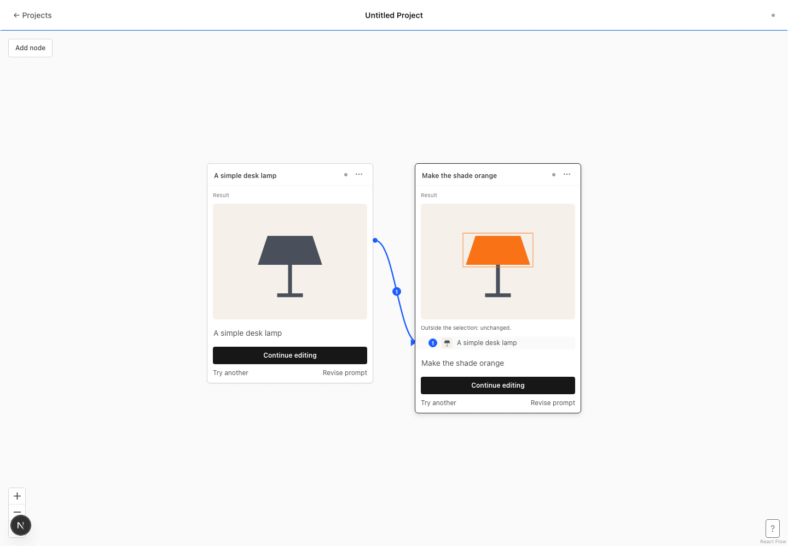

# One node, one image

A successful run turns its draft into a frozen result. A new draft has no main image until its own run succeeds; any pinned input remains visible only in the input row. Continue editing is the only forward action and inherits White bg from the input node. Every node shows White bg; new nodes default to on, and running/result nodes show the frozen setting. Titles stay empty until someone names the node. Failed runs remain editable and retryable. Titles and canvas positions remain editable throughout.

Saving an area selection outlines the input, changes the prompt placeholder, focuses the prompt, and explains that Run is next. References and area selections exclude each other in both the editor and API. Results retain their outline and display the outside-selection preservation measurement under the image.

The canvas is the history. Exactly two selected image nodes expose Compare, whose captions use node names or prompt words. The help button contains the requested six invariants verbatim and the shortcut table. The sole use of “version” in application copy is the verbatim fourth invariant; controls and errors use the new vocabulary.

## Migration and legacy references

Apply Alembic migration `c9512e4a731b` before serving the new build. It restores the newest image on older nodes whose presented image was cleared by Hide, and removes obsolete visibility preferences. It does not split nodes or remove image artifacts. Every retained legacy image is available in the read-only strip; the only operation in that strip is selecting the image to present.

A draft reference to a legacy node resolves its currently presented image when Run is submitted. A solid input wire keeps its chosen image. Completed runs retain their recorded input image IDs even if a legacy source later presents another image. Legacy nodes cannot run again. New submissions and worker commits both reject a second image on a node, and PATCH/PUT/DELETE guards protect frozen generation inputs.

## Review capture

[Watch the 30-second workflow](workflow.webm): new project → generate → continue editing → area selection → run.

The capture uses the real frontend with the deterministic browser-test provider; it demonstrates UI behavior without a paid image-provider call. The fixture returns a dark lamp followed by an orange shade so the two steps are visible. API and worker tests separately exercise freezing, image retention, queued requests, and compositing with provider doubles.

## Verification

- Backend tests cover frozen-field conflicts, running locks, retry after failure, duplicate inputs and seeds, legacy selection, and both selection/reference conflicts.
- Browser tests cover every edge-case row in the brief, frozen and failed cards, armed selections, Continue editing, Compare selection cardinality, ten-card placement, framing, help, and the empty canvas.
- Verified: 105 backend tests passed, 35 browser tests passed, 2 frontend unit tests passed, production build, type checking, ESLint, and Ruff. Seven PostgreSQL-specific tests were skipped because `TEST_DATABASE_URL` was not configured.
- A migration test verifies that restoring a formerly hidden image preserves both the node and artifact.

The September 4 implementation guide and earlier cleanup captures are historical starting points; this document describes the current model.
